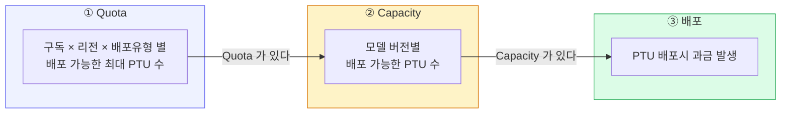
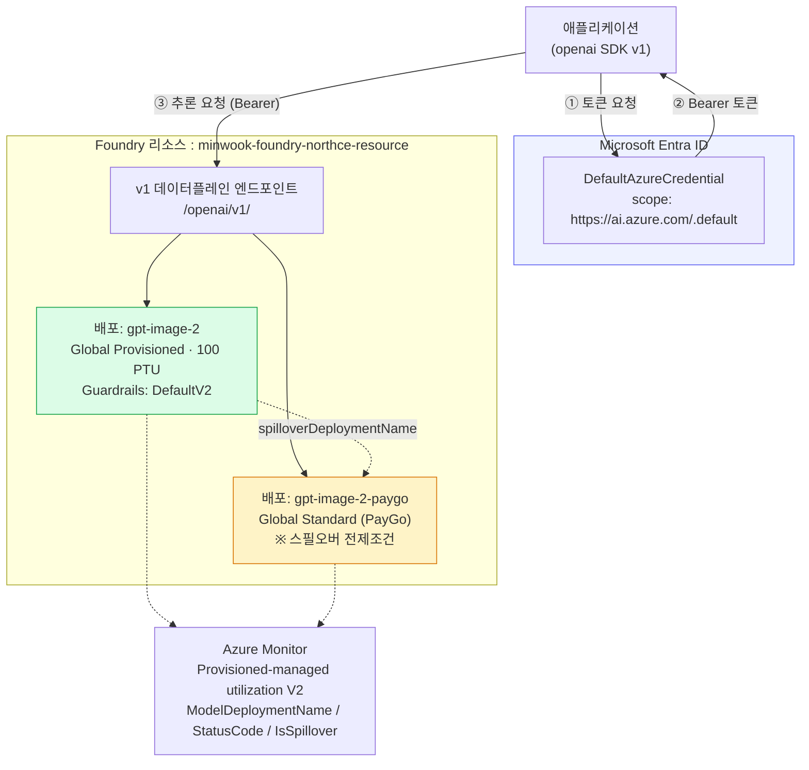
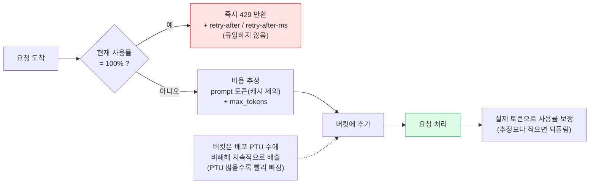
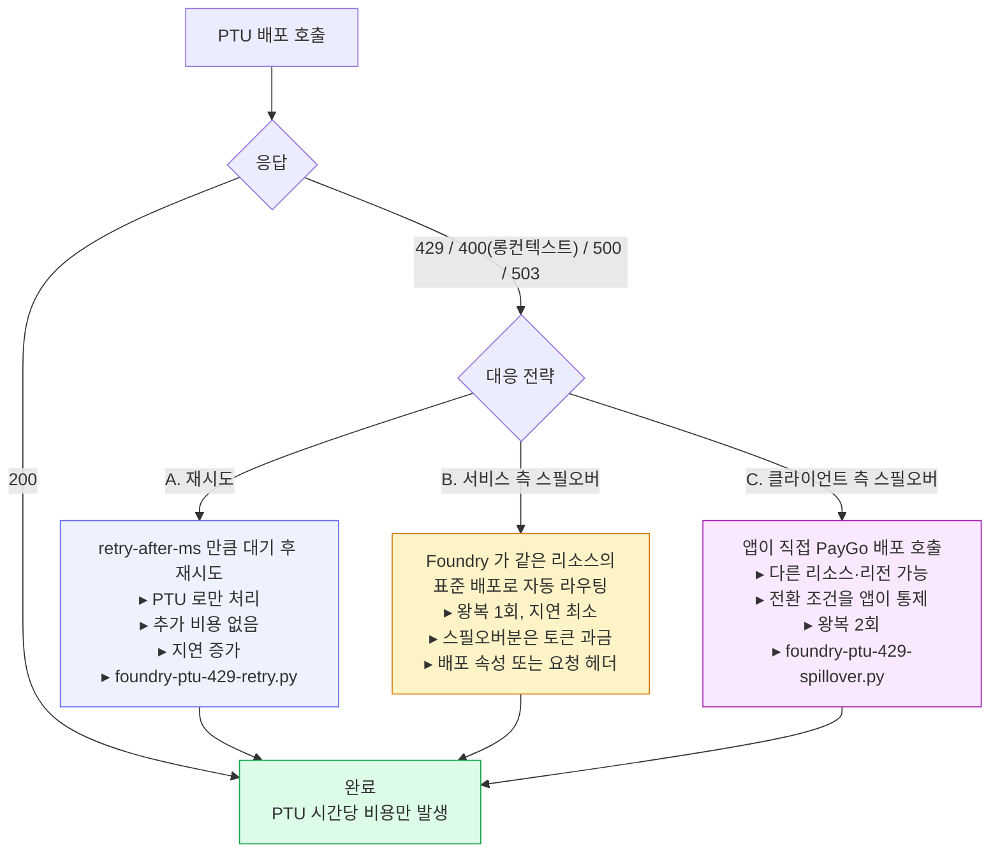
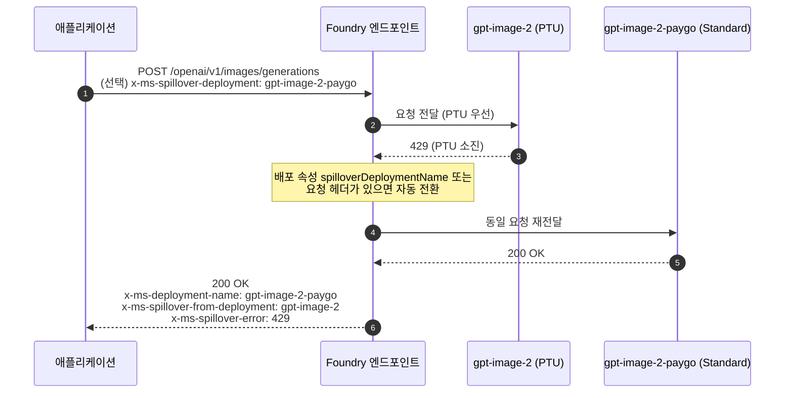
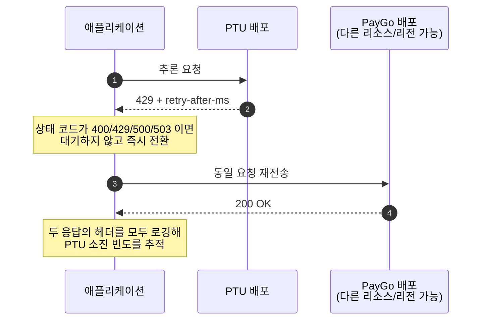

# Microsoft Foundry PTU 사용 가이드

Microsoft Foundry 에서 [PTU(Provisioned Throughput Unit)](https://learn.microsoft.com/en-us/azure/ai-foundry/openai/concepts/provisioned-throughput) 로 모델을 배포하고, 사용하는 방법을 다룬다.

---

---

## 목차

1. [요약](#요약)
2. [PTU 란](#1-ptu-란)
3. [포털에서 PTU 배포하기](#2-포털에서-ptu-배포하기)
4. [아키텍처 블록 다이어그램](#3-아키텍처-블록-다이어그램)
5. [샘플 코드 실행](#4-샘플-코드-실행)
6. [정리 — 과금 중단](#5-정리--과금-중단)

---

## 요약

- PTU 는 처리 용량(throughput)을 시간 단위로 구매하는 배포 방법으로, 배포되어 Endpoint 가 제공되면 hourly billing 로 과금이 발생한다. 배포를 지워야 과금이 멈춘다.
- PTU 의 처리 용량을 초과하는 요청은 Too Many Requests (429 HTTP Status Code) 로 즉시 응답하여, 사용자에게 제어권을 넘긴다.
- 429 를 받은 요청은 재시도하거나, spillover 로 Standard 배포에 넘겨 처리한다.

---

## 1. PTU 란
PTU 는 Provisioned Throughput Unit 으로, 모델의 처리 토큰 용량을 미리 구매하는 모델 배포 유형이다. 참고로, 다른 배포 유형으로는 Standard (Priority processing 포함) 과 Batch 가 있으며 TPM (Tokens Per Minute) 을 정하여 모델을 배포할 수 있다.
PTU 배포는 시간당 처리 용량을 미리 구매하고 배포된 모델 endpoint 에 대해 hourly billing 으로 청구된다. TPM 의 배포 유형들은 사용한 토큰량만큼 비용이 청구된다.
PTU 는 정해진 처리량에 대해 일정한 처리 속도를 보장하여 대규모·미션크리티컬한 워크로드에 적합하다. TPM 은 트래픽 상황에 따라 탄력적으로 워크로드 운영이 가능하다.
PTU 는 모델에 종속되지 않는다. 같은 리전·배포 유형의 쿼터를 지원되는 어떤 모델에도 쓸 수 있어, 모델을 바꿔도 쿼터를 다시 신청하지 않는다.

### 1.1 Deployment location

| Location 별 배포 유형 | 설명 |
|---|---|
| Global Provisioned | 뛰어난 가용성으로 global 배포 |
| Data Zone Provisioned | 지리적 Zone(US·EU)에 배포 |
| Regional Provisioned | Single region 에 배포. Data residency 준수 |

### 1.2 Quota · Capacity

PTU 를 사용하고자 한다면 먼저 [PTU 쿼터 요청](https://aka.ms/oai/stuquotarequest)으로 PTU 쿼터를 신청한다(포털 **Manage → Quota → Request Quota** 에서 신청). 승인까지 며칠 걸릴 수 있다.


핵심 함정:

- **쿼터가 있다고 용량이 보장되지 않는다.** 용량은 하루 중에도 계속 변한다.
- **배포를 줄이거나 지우면 용량이 리전 풀로 반환**되고, 다시 올릴 때 같은 용량이 있다는 보장이 없다.
- **예약(Reservation)도 용량을 보장하지 않는다.** 반드시 **배포를 먼저 만들어 용량을 확인한 뒤** 예약을 산다.

### 1.3 PTU Sizing

PTU Sizing 은 포털의 Capacity calculator 를 이용하여 간편하게 계산할 수 있다 (포털 **Manage → Quota → Provisioned throughput unit** 에서 확인). 계산시에 예상 트래픽에 대한 정보를 사용하여 PTU 를 예측한다.

| 입력 | 설명 |
|---|---|
| 토큰 크기 | Tokens in prompt call(입력 토큰), Tokens in model response(평균 출력 토큰) |
| 최고 RPM | Peak calls per min (RPM) |
| 캐시율 | 캐시로 처리된 입력 토큰은 **PTU 용량을 소비하지 않는다**(100% 할인) |

PTU 계산은 워크로드별 모델 예측 사용량인 TPM 을 계산하여 모델의 [Input TPM per PTU](https://learn.microsoft.com/ko-kr/azure/foundry/openai/how-to/provisioned-throughput-sizing#deployment-parameters-and-throughput-values-by-model) 로 나누어 계산한다.

### 1.4 과금

PTU 는 배포된 PTU 수에 따라 hourly billing `$/PTU/hr` 으로 청구된다. 요청 처리 여부와 무관하게 배포가 존재한 시간만큼 청구되며, 1시간을 채우지 않았다면 비례 계산된다. 예를 들어, 배포 시간이 15분이라면 요금은 1/4로 청구된다. 배포의 PTU 수를 조정하면 과금도 즉시 새 PTU 수로 바뀐다.

장기간 운영한다면 Azure Reservation 으로 1개월 또는 1년 약정을 걸어 단가를 낮춘다. Reservation 은 배포가 아니라 PTU 미터에 적용되는 재무 할인이라 배포와 독립적으로 구매하며, 용량을 보장하지는 않는다. 배포로 용량을 먼저 확보한 뒤 Reservation 을 구매한다.

---

## 2. 포털에서 PTU 배포하기

### 2.1 프로젝트 홈에서 엔드포인트 확인


**New Foundry** 토글이 켜져 있어야 한다. 홈 화면에서 두 종류의 엔드포인트를 확인할 수 있다.

| 항목 | 값 |
|---|---|
| Project endpoint | `https://minwook-foundry-northce-resource.services.ai.azure.com/...` |
| Azure OpenAI endpoint | `https://minwook-foundry-northce-resource.openai.azure.com/...` |
| API key | **비활성화됨** → Entra ID 인증만 사용 |

> 추론에는 두 호스트 중 어느 쪽을 써도 된다. 다만 **경로가 반드시 `/openai/v1/` 로 끝나야** 하며, 아니면 404 가 난다. 스크립트는 `FOUNDRY_ENDPOINT` 에 호스트만 넣어도 이 경로를 자동으로 붙인다.

### 2.2 모델 검색


**Discover → Models** 에서 모델을 찾는다. 좌측 필터의 **Deployment SKU** / **Collections(Direct from Azure)** 로 PTU 지원 모델만 좁힐 수 있다.

### 2.3 Deploy → Custom settings


**Deploy** 버튼의 두 갈래 중 반드시 **Custom settings** 를 고른다.

- *Default settings*: global standard + 기본 쿼터 → **PTU 배포가 아니다**
- *Custom settings*: SKU, 쿼터, PTU, 스필오버, 가드레일 직접 지정

### 2.4 배포 유형과 PTU 계산기


| 항목 | 캡처 값 |
|---|---|
| Deployment name | `gpt-image-2` |
| Deployment type | **Global Provisioned Throughput** |
| Model version | `2026-04-21-private` |

**Calculate provisioned throughput unit (PTU) capacity** 에 다음 세 값을 넣고 **Calculate** 를 누르면 필요한 PTU 추정치가 나온다.

- Input tokens per minute
- Output tokens per minute
- Requests per minute

### 2.5 PTU 수량과 요금 확인


- **Provisioned throughput units (PTUs)**: `100 / 100` — 슬라이더 오른쪽 값이 이 구독·리전·배포유형의 남은 쿼터다.
- **Guardrails**: `DefaultV2`
- **Pricing terms**: *"charged $100.00 per hour (list price, USD) if run as an on-demand deployment"* — Azure Reservation 으로 크게 낮출 수 있다는 안내가 함께 나온다.
- 체크박스에 동의해야 **Deploy** 가 활성화된다.

### 2.6 Traffic spillover 켜기


**Traffic spillover** 토글을 켜면 **Spillover deployment** 를 골라야 한다. 이것이 [스필오버 문서](https://learn.microsoft.com/en-us/azure/ai-foundry/openai/how-to/spillover-traffic-management)가 설명하는 배포 속성 `spilloverDeploymentName` 에 해당한다.

> ⚠️ 캡처의 경고 그대로: **동일 모델·동일 버전의 활성 표준(PayGo) 배포가 같은 리소스 안에 최소 하나 있어야** 스필오버를 켤 수 있다. 없으면 드롭다운이 비어 Deploy 가 막힌다.
>
> → **표준 배포를 먼저 만들고, 그다음 PTU 배포를 만들면서 스필오버를 지정**하는 순서가 편하다. 이미 만든 PTU 배포에 나중에 추가해도 된다.

REST([Deployments - Create Or Update](https://learn.microsoft.com/en-us/rest/api/aiservices/accountmanagement/deployments/create-or-update))로 설정할 경우:

```bash
curl -X PUT "https://management.azure.com/subscriptions/<SUB_ID>/resourceGroups/<RG>/providers/Microsoft.CognitiveServices/accounts/<ACCOUNT>/deployments/gpt-image-2?api-version=2024-10-01" \
  -H "Content-Type: application/json" \
  -H "Authorization: Bearer $(az account get-access-token --resource https://management.azure.com --query accessToken -o tsv)" \
  -d '{
        "sku": { "name": "GlobalProvisionedManaged", "capacity": 100 },
        "properties": {
          "spilloverDeploymentName": "gpt-image-2-paygo",
          "model": { "format": "OpenAI", "name": "gpt-image-2", "version": "2026-04-21" }
        }
      }'
```

### 2.7 배포 확인


**Build → Models → Deployments → Serverless deployments** 에서 상태를 확인한다. `Deployment type` 이 `Global Provi...`, `Deployment status` 가 `Succeeded` 면 완료다. 이 화면 상단의 **PTU Calculator** 버튼으로 사이징을 다시 계산할 수도 있다.

### 2.8 샘플 코드 확인


Playground 의 **View code** 를 누르면,


Language / Authentication method 를 고른 샘플이 나온다. **Entra ID authentication** 기준 Python 코드가 이 리포 스크립트의 출발점이다. 다른 언어(.NET, JavaScript, Java, Go)의 동일 예제는 [Azure OpenAI SDK language support](https://learn.microsoft.com/en-us/azure/foundry/openai/supported-languages) 에 있다.

```python
from openai import OpenAI
from azure.identity import DefaultAzureCredential, get_bearer_token_provider

endpoint = "https://minwook-foundry-northce-resource.services.ai.azure.com/openai/v1"
deployment_name = "gpt-image-2"
token_provider = get_bearer_token_provider(
    DefaultAzureCredential(), "https://ai.azure.com/.default"
)

client = OpenAI(base_url=endpoint, api_key=token_provider)
```

포인트 세 가지:

1. `AzureOpenAI` 가 아니라 **`OpenAI`** 클라이언트를 쓴다 (v1 데이터플레인).
2. `api_key` 에 **토큰 프로바이더 함수를 그대로 넘긴다** — 만료 시 자동 갱신된다. `openai>=1.106.0` 필요.
3. `model` 파라미터에는 모델 이름이 아니라 **배포 이름**을 넣는다.

### 2.9 배포 삭제


hourly billing 은 배포를 지워야 멈춘다. 전체 정리 절차는 [5. 정리 — 과금 중단](#5-정리--과금-중단) 참고.

### 2.10 모니터링 — PTU 사용률

Azure Portal → 리소스 → **Metrics** → **[Provisioned-managed utilization V2](https://learn.microsoft.com/en-us/azure/ai-foundry/openai/how-to/provisioned-get-started#measure-deployment-utilization)**

```
PTU 사용률 = 기간 내 소비 PTU / 기간 내 배포 PTU
```

배포가 여러 개면 **Apply splitting** 으로 배포별로 나눠 본다. 지속적으로 100% 에 붙어 있으면 PTU 를 늘리거나 스필오버를 켜야 한다는 신호다.

### 2.11 모니터링 — 스필오버 트래픽 분리

`Azure OpenAI Requests` 메트릭에 다음 분할을 적용한다.

| 분할 | 용도 |
|---|---|
| `ModelDeploymentName` | PTU 배포 vs 표준 배포 처리량 비교 |
| `StatusCode` | 200 / 429 분포 |
| `IsSpillover` | **표준 배포로 들어온 트래픽 중 스필오버분만 분리** |

> 중요: 스필오버된 요청은 PTU 배포 쪽에 429 로 **집계되지 않는다.** 표준 배포에 `IsSpillover = True` + 최종 상태 코드(보통 200)로 기록된다. PTU 배포의 429 카운트만 보고 "스필오버가 없다"고 판단하면 안 된다. 분할 적용 화면과 차트 예시는 [스필오버 모니터링 문서](https://learn.microsoft.com/en-us/azure/ai-foundry/openai/how-to/spillover-traffic-management#monitor-spillover-usage)에 있다.

---

## 3. 아키텍처 블록 다이어그램

### 3.1 전체 구성



### 3.2 PTU 사용률과 429 — leaky bucket



> `max_tokens` 를 실제 생성량보다 크게 잡으면 버킷을 과하게 채워 **동시 처리량이 줄어든다.** 가능한 한 실제 값에 가깝게 지정할 것. 이 leaky bucket 동작과 429 대응 지침의 원문은 [프로덕션 운영 문서](https://learn.microsoft.com/en-us/azure/ai-foundry/openai/how-to/provisioned-get-started)에 있다.

### 3.3 429 대응 3가지 경로



### 3.4 서비스 측 스필오버 시퀀스



> 표준 배포마저 실패하면 표준 배포의 상태 코드와 본문이 그대로 반환된다. 이때도 `x-ms-spillover-from-deployment` 와 `x-ms-spillover-error` 는 남아 있어, "스필오버 실패"와 "표준 배포 직접 실패"를 구분할 수 있다.

### 3.5 클라이언트 측 스필오버 시퀀스



샘플 스크립트는 응답 헤더를 아래 세 그룹으로 나눠 출력하고, 분류에 없는 헤더도 `[기타]` 로 함께 찍는다.

### 3.6 응답 헤더 — 스로틀링 / 재시도

| 헤더 | 의미 |
|---|---|
| `retry-after-ms` | **밀리초 단위 대기 시간.** 더 정밀하므로 우선 사용 |
| `retry-after` | 초 단위 대기 시간 |
| `x-ratelimit-remaining-requests` | 남은 요청 수 |
| `x-ratelimit-remaining-tokens` | 남은 토큰 수 |
| `x-ratelimit-limit-requests` / `-tokens` | 한도 |
| `x-ratelimit-reset-requests` / `-tokens` | 한도 리셋까지 남은 시간 |

> PTU 배포는 429 와 함께 `retry-after` **와** `retry-after-ms` 를 모두 돌려준다. 임의의 지수 백오프보다 이 값을 쓰는 편이 정확하다 — 버킷이 언제 비는지는 서비스만 알기 때문이다.

### 3.7 응답 헤더 — 스필오버

| 헤더 | 의미 |
|---|---|
| `x-ms-deployment-name` | **실제로 요청을 처리한 배포 이름.** 스필오버됐다면 표준 배포 이름이 들어온다 |
| `x-ms-spillover-from-deployment` | **존재 자체가 스필오버됐다는 뜻.** 값은 원래의 PTU 배포 이름 |
| `x-ms-spillover-error` | 스필오버를 유발한 PTU 쪽 원본 상태 코드 (429 / 500 / 503 등). 스필오버 성공 여부와 무관하게 항상 붙는다 |

`foundry-ptu-basic.py` 는 이 세 헤더만 보고 **서비스 측 스필오버가 실제로 일어났는지** 판정한다.

### 3.8 응답 헤더 — 추적 / 진단

`apim-request-id`, `x-request-id`, `x-ms-request-id`, `x-ms-client-request-id`, `x-ms-region`, `azureml-model-session`, `openai-processing-ms`, `openai-model`, `x-envoy-upstream-service-time`

지원 티켓을 열 때는 `apim-request-id` 또는 `x-request-id` 를 함께 제출한다.

---

## 4. 샘플 코드 실행

### 4.1 파일 구성

| 파일 | 역할 |
|---|---|
| `foundry_ptu_common.py` | 설정 로딩 · 클라이언트 생성 · 호출 · **헤더 덤프** 공용 모듈 (세 스크립트가 공유) |
| `foundry-ptu-basic.py` | 기본 호출 1회. 헤더 전체 출력 + **서비스 측 스필오버 발생 여부 판정** |
| `foundry-ptu-429-retry.py` | 429 를 `retry-after-ms` 기준으로 재시도. 백오프 폴백 + 부하 생성 |
| `foundry-ptu-429-spillover.py` | **클라이언트 측 스필오버**(PTU → PayGo) 및 요청 헤더 방식 비교 |

헤더 덤프 로직이 공통이라 모듈로 분리했다. 스크립트만 복사하면 동작하지 않으니 `foundry_ptu_common.py` 를 함께 둔다.

### 4.2 설치

```bash
python3 -m venv .venv && source .venv/bin/activate
pip install "openai>=1.106.0" azure-identity
az login   # DefaultAzureCredential 이 사용할 자격 증명
```

Entra ID 인증에는 Foundry 리소스에 대한 **Cognitive Services OpenAI User** 이상의 역할이 필요하다.

### 4.3 환경 변수

| 변수 | 필수 | 기본값 | 설명 |
|---|---|---|---|
| `FOUNDRY_ENDPOINT` | ✅ | — | 리소스 엔드포인트. `/openai/v1/` 는 자동으로 붙여준다 |
| `FOUNDRY_PTU_DEPLOYMENT` | ✅ | — | PTU 배포 이름 |
| `FOUNDRY_STANDARD_DEPLOYMENT` | 스필오버 시 ✅ | — | 표준(PayGo) 배포 이름 |
| `FOUNDRY_STANDARD_ENDPOINT` | | PTU 와 동일 | 표준 배포가 **다른 리소스**에 있을 때만 지정 |
| `FOUNDRY_API_KEY` | | (없음) | 지정하면 키 인증, 없으면 Entra ID |
| `FOUNDRY_TOKEN_SCOPE` | | `https://ai.azure.com/.default` | classic 데이터플레인은 `https://cognitiveservices.azure.com/.default` |
| `FOUNDRY_MODE` | | `image` | `image` \| `chat` |
| `FOUNDRY_PROMPT` | | 모드별 기본값 | 프롬프트 |
| `FOUNDRY_IMAGE_SIZE` | | `1024x1024` | image 모드 전용 |
| `FOUNDRY_MAX_TOKENS` | | `256` | chat 모드 전용. **PTU 사용률 추정에 직접 반영**되므로 실제 생성량에 맞춘다 |
| `FOUNDRY_MAX_ATTEMPTS` | | `5` | retry 스크립트 최대 시도 횟수 |
| `FOUNDRY_BURST` | | `1` | 동시 요청 수. 2 이상이면 429 를 실제로 유발할 수 있다 |
| `FOUNDRY_SPILLOVER_MODE` | | `client` | `client` \| `header` \| `both` |

```bash
export FOUNDRY_ENDPOINT="https://minwook-foundry-northce-resource.openai.azure.com"
export FOUNDRY_PTU_DEPLOYMENT="gpt-image-2"
export FOUNDRY_STANDARD_DEPLOYMENT="gpt-image-2-paygo"
export FOUNDRY_MODE="image"
```

### 4.4 실행

**① 기본 호출 — 헤더로 현재 상태 파악**

```bash
python foundry-ptu-basic.py
```

출력에서 확인할 것:

- `x-ms-deployment-name` 이 PTU 배포 이름인가 → 스필오버 없이 PTU 가 직접 처리
- `x-ms-spillover-from-deployment` 가 있는가 → **배포 속성 스필오버가 동작 중**
- `[스필오버 판정]` 섹션이 위 두 헤더를 사람이 읽을 문장으로 정리해 준다

**② 429 재시도 — 부하를 걸어 실제로 유발**

```bash
FOUNDRY_BURST=20 FOUNDRY_MAX_ATTEMPTS=6 python foundry-ptu-429-retry.py
```

`retry-after-ms` 가 있으면 그 값을, 없으면 지수 백오프(1s → 2s → 4s …, 상한 30s)를 쓴다. 동시 요청이 같은 시각에 재차 몰리지 않도록 25% 지터를 더한다. 워커별 시도 횟수와 총 대기 시간이 요약으로 나온다.

이 스크립트는 429 동작을 눈으로 보기 위한 것이다. 실제 용량 산정을 위한 부하 테스트에는 [azure-openai-benchmark](https://github.com/Azure/azure-openai-benchmark) 를 쓰고, 정상 상태 수치를 얻으려면 최소 10분 이상 돌린다.

**③ 클라이언트 측 스필오버**

```bash
# PTU 실패 시 앱이 직접 PayGo 배포로 전환
python foundry-ptu-429-spillover.py

# 서비스에 per-request 스필오버를 요청 (x-ms-spillover-deployment 헤더)
FOUNDRY_SPILLOVER_MODE=header python foundry-ptu-429-spillover.py

# 두 방식을 나란히 비교
FOUNDRY_SPILLOVER_MODE=both FOUNDRY_BURST=20 python foundry-ptu-429-spillover.py
```

> ⚠️ 배포 속성 `spilloverDeploymentName` 이 이미 설정돼 있으면 **배포 설정이 우선**하고 `x-ms-spillover-deployment` 헤더는 무시된다. 요청 단위로만 제어하려면 배포 속성을 비워 둔다.

### 4.5 SDK 자동 재시도와의 관계

openai SDK 는 기본적으로 408/409/429/5xx 를 `retry-after` 를 존중하며 2회 재시도한다. 이 샘플들은 **매 시도의 헤더를 직접 보여주기 위해 `max_retries=0` 으로 꺼두었다.**

프로덕션에서 굳이 직접 구현할 필요는 없다. SDK 에 맡기려면:

```python
client = OpenAI(base_url=endpoint, api_key=token_provider, max_retries=5)

# 또는 요청 단위로
client.with_options(max_retries=5).chat.completions.create(...)
```

### 4.6 429 대응 전략 선택

| 상황 | 권장 전략 |
|---|---|
| 지연에 민감하고 비용 초과를 감수할 수 있다 | **서비스 측 스필오버** — 왕복 1회로 가장 빠르다. Global / Data Zone Provisioned 배포에는 기본으로 켜두길 권장 |
| PTU 비용 안에서만 처리해야 한다 (배치성, 비대화형) | **재시도** — `retry-after-ms` 만큼 대기. 추가 토큰 비용 없음 |
| PayGo 백업이 다른 리소스·리전에 있거나, 전환 조건을 세밀하게 통제해야 한다 | **클라이언트 측 스필오버** |
| 롱컨텍스트 요청이 400 으로 떨어진다 (예: gpt-4.1 계열 PTU 는 128K 미만만 지원) | **스필오버** — 재시도해도 계속 400 이다 |

비용 관점:

- PTU 가 처리한 요청 → **시간당 PTU 비용만.** 추가 과금 없음
- 스필오버되어 표준 배포가 처리한 요청 → 해당 모델·배포유형의 **입력 / 캐시 / 출력 토큰 요금**이 별도 발생

---

## 5. 정리 — 과금 중단

hourly billing 은 배포 생성 시점에 시작해 삭제 시점에 멈춘다. 리소스만 지우고 배포를 남기면 **리소스를 purge 할 때까지 과금이 계속된다.**

1. 포털에서 **배포를 먼저 삭제**한다 (2.9 캡처).
2. 리소스도 지운다면 **모든 배포를 지운 뒤** 리소스를 삭제한다.
3. 삭제한 리소스를 **purge** 해 과금을 확실히 끊는다.
4. **예약은 배포 삭제로 취소되지 않는다.** Azure Portal → Reservations 에서 별도로 취소/교환한다 (수수료 발생 가능).
