# Microsoft Foundry PTU 사용 가이드

Microsoft Foundry 에서 [PTU(Provisioned Throughput Unit)](https://learn.microsoft.com/en-us/azure/ai-foundry/openai/concepts/provisioned-throughput) 로 모델을 배포하고, 사용하는 방법을 다룬다.

---

## 목차

0. [요약](#0-요약)
1. [PTU 란](#1-ptu-란)
2. [AI Portal 에서 PTU 배포하기](#2-ai-portal-에서-ptu-배포하기)
3. [Sample Code](#3-sample-code)
4. [마무리](#4-마무리)

---

## 0. 요약

- PTU 는 처리 용량(throughput)을 시간 단위로 구매하는 배포 방법으로, PTU 모델 배포가 완료되면 과금이 발생한다. **⚠️ 꼭, 미사용시에는 PTU 모델 배포를 삭제해야 한다.** ([AI Portal 에서 PTU 배포하기](#2-ai-portal-에서-ptu-배포하기) 참고)
- PTU 모델 배포의 처리 용량을 초과하는 요청은 Too Many Requests (429 HTTP Status Code) 로 즉시 응답한다. 이에 대한 retry 나 spillover 전략을 갖춰야 한다 ([Sample Code](#3-sample-code) 참고).

---

## 1. PTU 란
PTU 는 Provisioned Throughput Unit 으로, 모델의 처리 토큰 용량을 미리 구매하는 모델 배포 유형이다. 참고로, 다른 배포 유형으로는 Standard (Priority processing 포함) 과 Batch 가 있으며 TPM (Tokens Per Minute) 을 정하여 모델을 배포할 수 있다.
PTU 배포는 시간당 처리 용량을 미리 구매하고 배포된 모델 endpoint 에 대해 hourly billing 으로 청구된다. TPM 의 배포 유형들은 사용한 토큰량만큼 비용이 청구된다.
PTU 는 정해진 처리량에 대해 일정한 처리 속도를 보장하여 대규모·미션크리티컬한 워크로드에 적합하다. TPM 은 트래픽 상황에 따라 탄력적으로 워크로드 운영이 가능하다.
PTU 는 모델에 종속되지 않는다. 같은 리전·배포 유형의 쿼터를 지원되는 어떤 모델에도 쓸 수 있어, 모델을 바꿔도 쿼터를 다시 신청하지 않는다.

### 1.1 Deployment location

| Location 별 배포 유형 | 설명 |
|---|---|
| Global Provisioned | 뛰어난 가용성으로 global 배포 |
| Data Zone Provisioned | 지리적 Zone(US·EU)에 배포 |
| Regional Provisioned | Single region 에 배포. Data residency 준수 |

### 1.2 Quota · Capacity

PTU 를 사용하고자 한다면 먼저 [PTU 쿼터 요청](https://aka.ms/oai/stuquotarequest)으로 PTU 쿼터를 신청한다(포털 **Manage → Quota → Request Quota** 에서 신청). 승인까지 며칠 걸릴 수 있다.
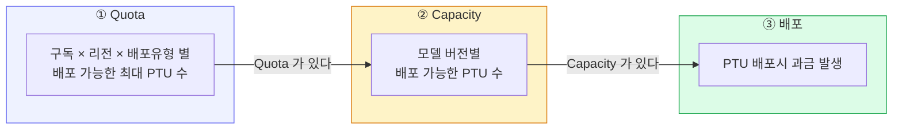

핵심 함정:

- **쿼터가 있다고 용량이 보장되지 않는다.** 용량은 하루 중에도 계속 변한다.
- **배포를 줄이거나 지우면 용량이 리전 풀로 반환**되고, 다시 올릴 때 같은 용량이 있다는 보장이 없다.
- **예약(Reservation)도 용량을 보장하지 않는다.** 반드시 **배포를 먼저 만들어 용량을 확인한 뒤** 예약을 산다.

### 1.3 PTU Sizing

PTU Sizing 은 포털의 Capacity calculator 를 이용하여 간편하게 계산할 수 있다 (포털 **Manage → Quota → Provisioned throughput unit** 에서 확인). 계산시에 예상 트래픽에 대한 정보를 사용하여 PTU 를 예측한다.

| 입력 | 설명 |
|---|---|
| 토큰 크기 | Tokens in prompt call(입력 토큰), Tokens in model response(평균 출력 토큰) |
| 최고 RPM | Peak calls per min (RPM) |
| 캐시율 | 캐시로 처리된 입력 토큰은 **PTU 용량을 소비하지 않는다**(100% 할인) |

PTU 계산은 워크로드별 모델 예측 사용량인 TPM 을 계산하여 모델의 [Input TPM per PTU](https://learn.microsoft.com/ko-kr/azure/foundry/openai/how-to/provisioned-throughput-sizing#deployment-parameters-and-throughput-values-by-model) 로 나누어 계산한다.

### 1.4 과금

PTU 는 배포된 PTU 수에 따라 hourly billing `$/PTU/hr` 으로 청구된다. 요청 처리 여부와 무관하게 배포가 존재한 시간만큼 청구되며, 1시간을 채우지 않았다면 비례 계산된다. 예를 들어, 배포 시간이 15분이라면 요금은 1/4로 청구된다. 배포의 PTU 수를 조정하면 과금도 즉시 새 PTU 수로 바뀐다.

장기간 운영한다면 Azure Reservation 으로 1개월 또는 1년 약정을 걸어 단가를 낮춘다. Reservation 은 배포가 아니라 PTU 미터에 적용되는 재무 할인이라 배포와 독립적으로 구매하며, 용량을 보장하지는 않는다. 배포로 용량을 먼저 확보한 뒤 Reservation 을 구매한다.

---

## 2. AI Portal 에서 PTU 배포하기

모델 배포를 만들고 삭제하려면 Foundry 리소스에 **Cognitive Services Contributor** 이상의 역할이 필요하다. 추론 요청만 한다면 [3. Sample Code](#3-sample-code) 의 `Cognitive Services OpenAI User` 로 충분하다.

### 2.1 Foundry project home에서 엔드포인트 확인

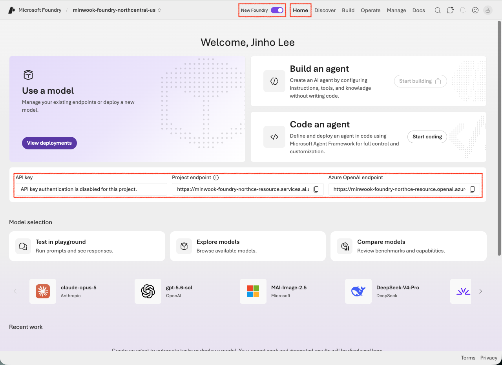

**New Foundry** 토글이 켜져 있어야 사진과 같이 New Foundry UI 로 진입한다. home 화면에서 두 종류의 엔드포인트를 확인할 수 있다. 추론 요청에는 2가지 host 모두 사용이 가능하며, url 경로는 `/openai/v1/` 로 끝나야 한다.

| 엔드포인트 | 값 |
|---|---|
| Project endpoint | `https://<foundry-resource-subdomain>.services.ai.azure.com/...` |
| Azure OpenAI endpoint | `https://<foundry-resource-subdomain>.openai.azure.com/...` |
| API key | Azure 구독 정책에 따라 비활성화될 수 있음 |

### 2.2 모델 검색

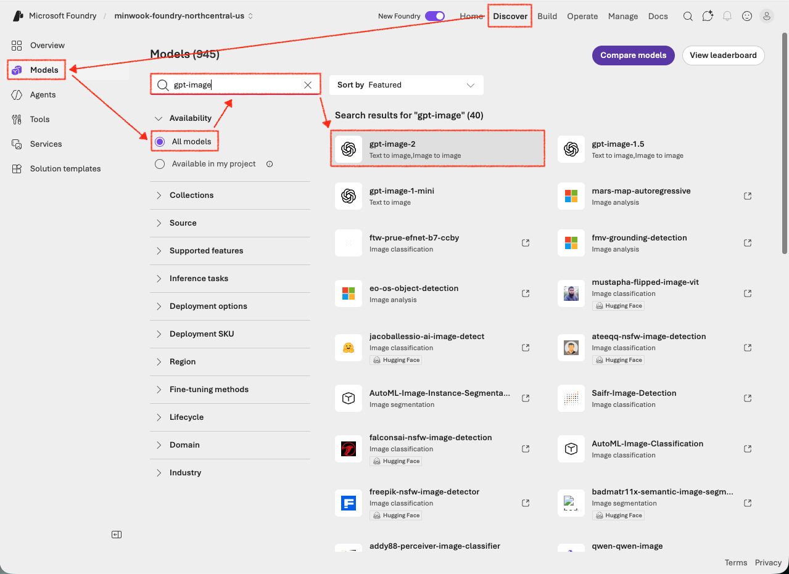

상단 navigator 에서 [Discover] → [Models] 에서 모델을 찾아 선택하고 모델 상세 페이지로 진입한다. 모델 검색 결과에 원하는 모델이 나오지 않는다면, Availability 에서 [All models] 를 선택한다.

### 2.3 Deploy → Custom settings

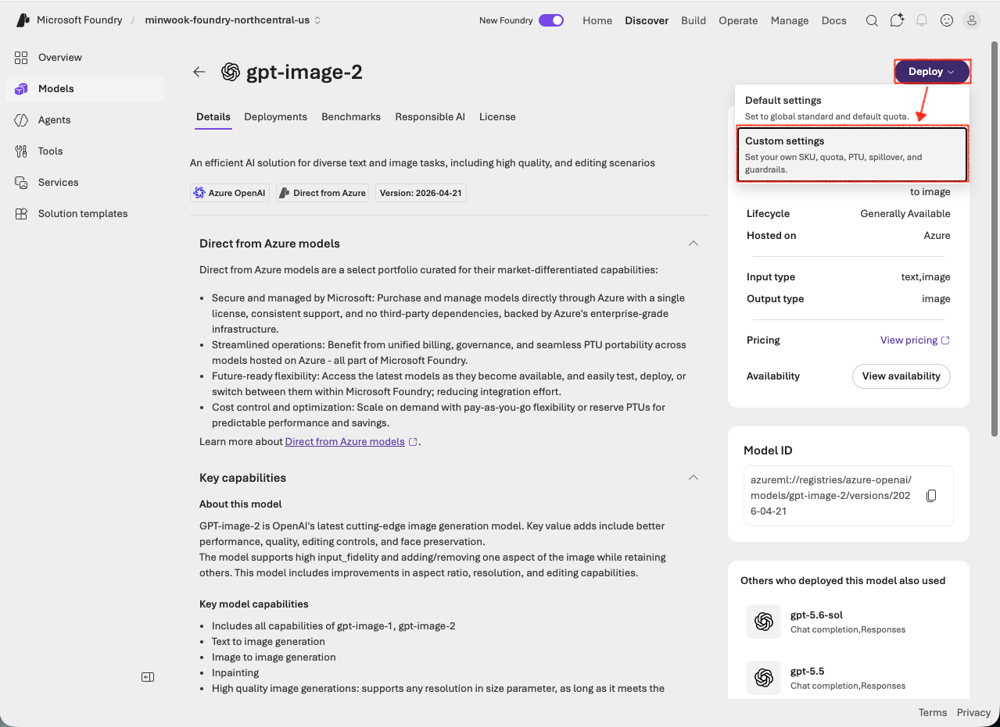

모델 상세 페이지에서 [Deploy] → [Custom settings] 를 선택한다. 참고로, Default settings 은 global standard 와 기본 quota 조합의 모델 배포 옵션이다.

### 2.4 상세 설정하여 모델 배포하기

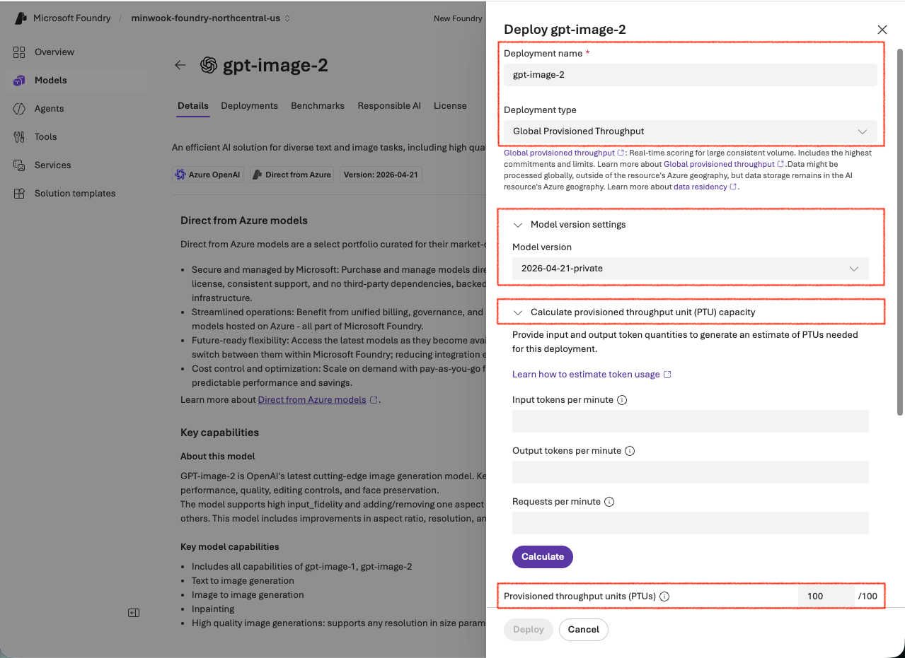
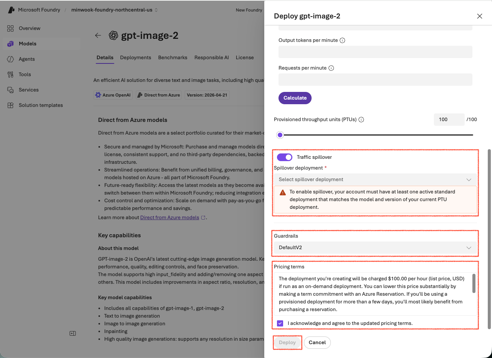

요청한 PTU 의 location 정보를 포함한 배포 유형에 맞춰 입력값을 선택한다. 일반적으로 Model version 은 latest 로 하여 배포한다. 배포에 할당한 PTUs 는 직접 입력이 가능하며, 상단에 있는 [Calculate provisioned throughput unit capacity] 를 이용하여 모델별 용량을 계산하여 PTUs 를 할당할 수도 있다.
모델 배포 엔드포인트는 정해진 capacity 를 초과한 요청에 대해서는 다른 엔드포인트로 [spillover](https://learn.microsoft.com/en-us/azure/ai-foundry/openai/how-to/spillover-traffic-management) 할 수 있다.

| 입력값 | 설명 | 예시 |
|---|---|---|
| Deployment name | 모델 배포 이름 | `gpt-image-2` |
| Deployment type | 모델 배포 유형 | **Global Provisioned Throughput** |
| Model version | 모델 상세 버전 | `2026-04-21-private` |
| Provisioned throughput units | 배포에 할당할 PTU 수 | `100` |
| Traffic spillover | (Optional) Spillover 시 연결할 배포 이름, 지정안해도 됨 | `gpt-image-2-paygo` |
| Guardrails | 모델 배포에 전후처리될 가드레일 instance | `DefaultV2` |
| Pricing terms | 과금에 대한 description, 체크박스에 동의해야 [Deploy] 활성화 | `acknowledged` |

입력값을 모두 설정했다면, [Deploy] 한다. [Traffic spillover] 를 사용하지 않을 거라면 disable 하여 [Deploy] 할 수 있다.

### 2.5 배포 확인

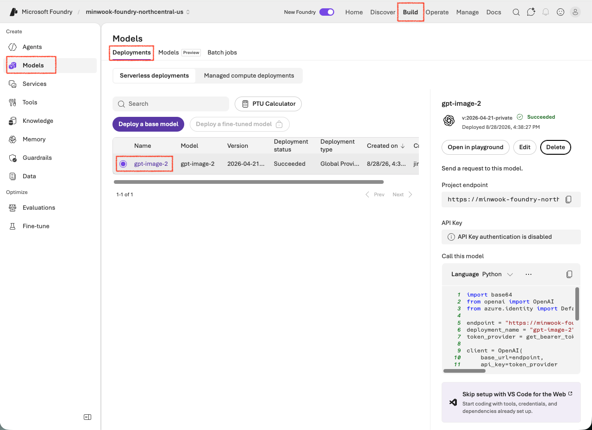

[Build] → [Models] → [Deployments] 에서 모델 배포를 확인한다. 모델을 선택하여 상세 페이지로 진입한다.

### 2.6 샘플 코드 확인

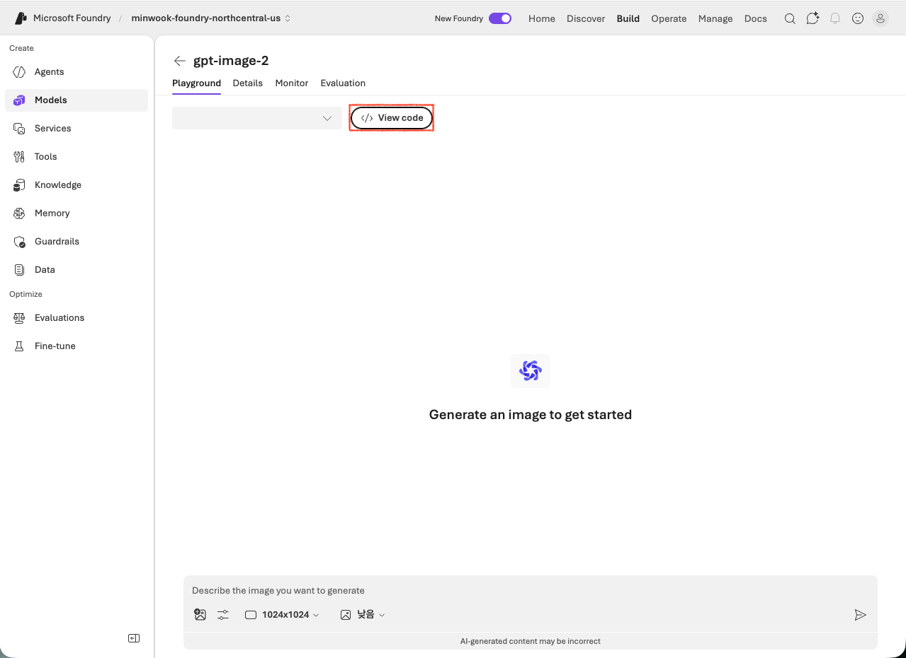

Playground 의 [View code] 를 누르면,

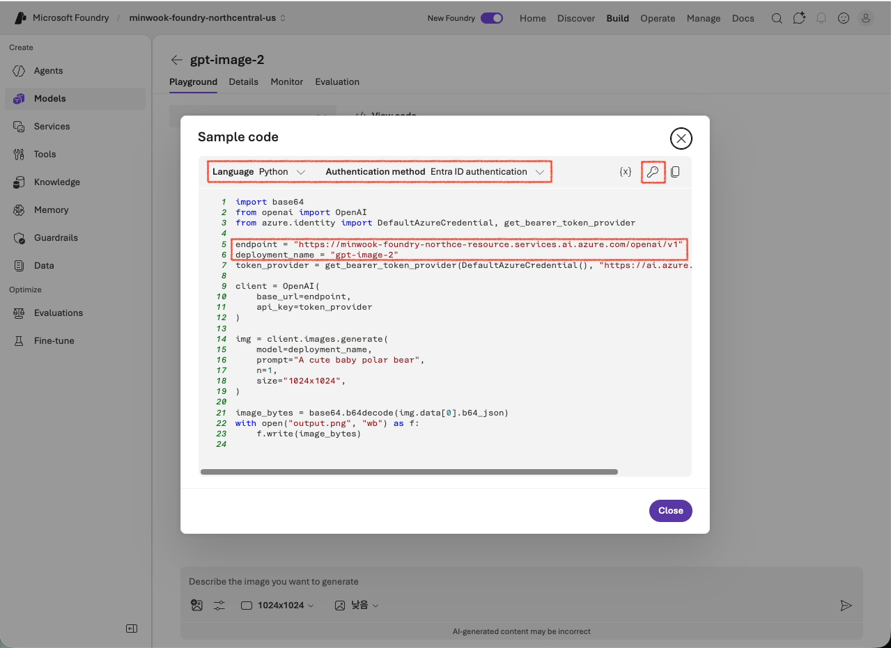

Language / Authentication method 를 고른 샘플이 나온다. 코드에 `endpoint` 와 `deployment_name` 을 확인하고, `authentication method` 는 개발 환경에 맞춰 설정하여 코드를 확인한다. [Sample code] 에서 짚고 넘어갈 사항은:
1. Framework client 로 `OpenAI` 클라이언트를 쓴다.
2. `api_key` 를 써도 되지만, 정책에 따라 `api_key` 를 사용이 불가하다면 `Entra ID` 로 인증 가능하다. (`az login` 필수)
3. 추론 요청 API 의 `model` 파라미터에는 모델 이름이 아니라 **배포 이름**을 넣는다.

### 2.7 배포 삭제

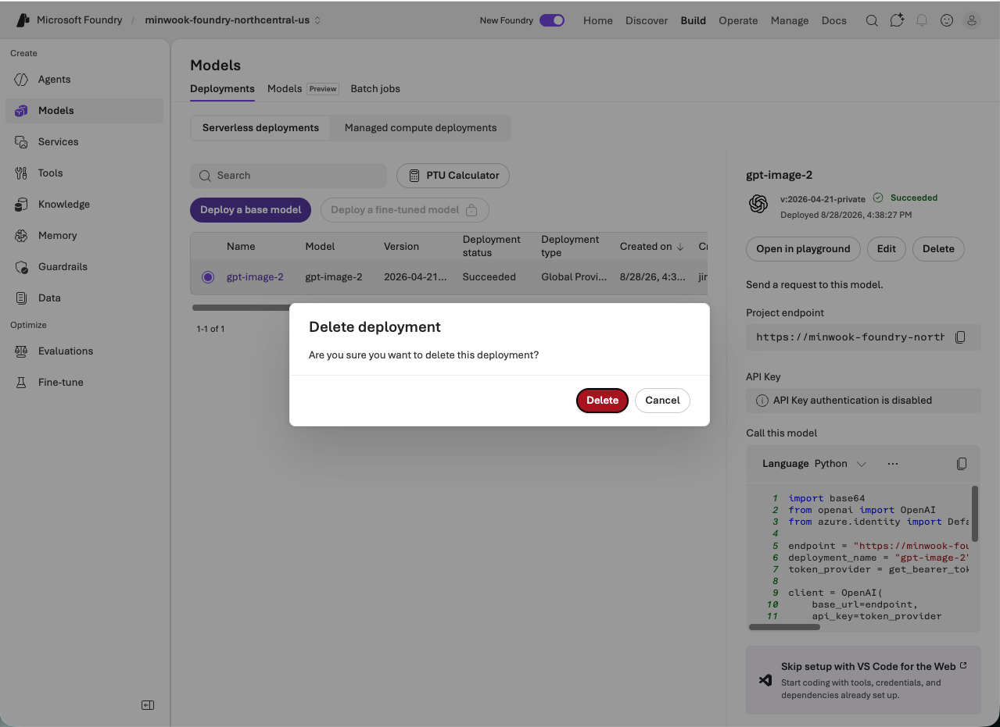

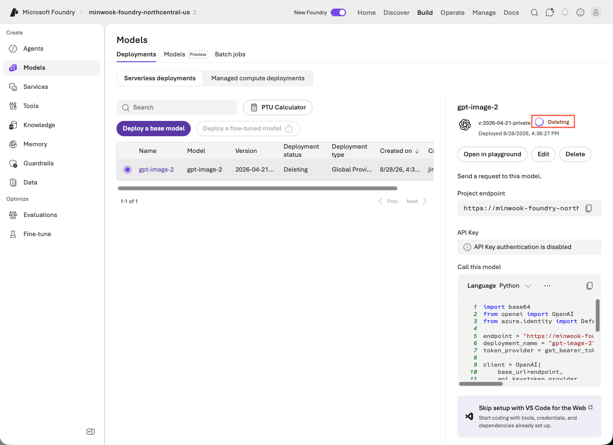

[delete] 을 눌러 모델 배포를 삭제한다. **⚠️ 과금은 모델 배포를 삭제해야 멈춘다.** Foundry 리소스만 삭제하면 purge (영구삭제) 될 때까지 배포가 남아 있어 과금이 지속된다.

### 2.8 모니터링
PTU 배포는 정해진 throughput 을 할당하여 운영하며 배포 엔드포인트에서 얼마나 throughput 을 소비하는지 `Azure Monitor` 를 통해 추적할 수 있다.
- [Azure Portal] → [Foundry 리소스] → [Monitoring - Metrics] → [[Provisioned-managed utilization V2](https://learn.microsoft.com/en-us/azure/ai-foundry/openai/how-to/provisioned-get-started#measure-deployment-utilization)]

PTU 배포가 다수가 존재하면 `Apply splitting` 으로 PTU 배포별로 나눠 볼 수 있다. Utilization 이 100% 에 saturation 된다면 PTU 를 증설하거나 spillover 해야 한다.

Spillover 된 요청은 [Azure OpenAI Requests](https://learn.microsoft.com/en-us/azure/ai-foundry/openai/how-to/spillover-traffic-management#monitor-spillover-usage) 메트릭에 `Apply splitting` 에 아래 파리미터를 적용하여 확인할 수 있다.
| 파라미터 | 용도 |
|---|---|
| `ModelDeploymentName` | 모델 배포 이름 |
| `StatusCode` | HTTP 응답 코드 |
| `IsSpillover` | Spillover 로 인한 요청 여부 |

Spillover 된 요청은 PTU 배포쪽에 429 로 집계되지 않고 해당 요청을 처리한 배포에 최종 HTTP Status code 로 기록된다 (정상 추론시 200).

---

## 3. Sample Code

Repository 는 foundry 의 모델 배포 엔드포인트에 대한 Python 클라이언트 코드를 가진다.

| 파일 | 역할 |
|---|---|
| `foundry-model-deploy-basic.py` | 기본 호출 로직. 이미지의 경우 `generate()` 과 `edit()` 호출 예시 제공 |
| `foundry-model-ptu-deploy-429-spillover.py` | PTU 모델 배포의 spillover 제어 로직. 서버측과 클라이언트측 예시 제공 |
| `foundry-model-ptu-deploy-429-retry.py` | PTU 모델 배포의 429 HTTP Status code `retry-after-ms` 제어 로직. 백오프 예시 제공 |

Python 코드들에 대한 실행 환경은 다음과 같다.

| 실행 환경 | 값 |
|---|---|
| Python | 3.11 이상 |
| 패키지 설치 | `pip install -r requirements.txt` |
| 인증 | Entra ID (`Cognitive Services OpenAI User` RBAC 필요) ・ `api-key` 인증 |

Entra ID 인증을 위해서는 실행 환경에서 `az login` 이 완료된 상태여야 한다.

### 3.1 `foundry-model-deploy-basic.py`

Microsoft Foundry 에 배포된 모델 엔드포인트에 대한 클라이언트의 추론 요청을 다룬다. 클라이언트가 Azure 와 인증을 완료하고 foundry 의 모델 배포 엔드포인트를 호출하여 응답을 처리하는 흐름은 아래와 같다.

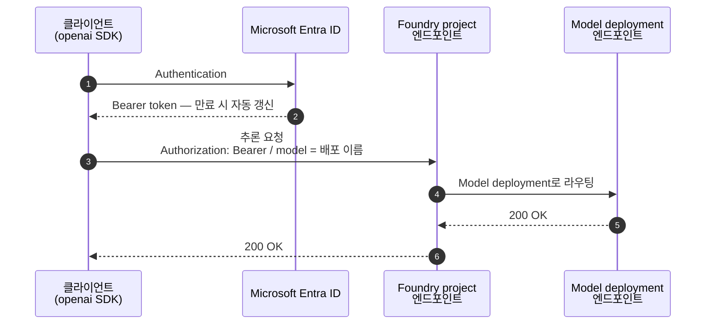

Python 코드의 입력 매개변수에 대한 설명은 아래와 같다.

| Arguments | Required | Default | Description |
|---|---|---|---|
| `--endpoint` | Yes | | 모델 배포 엔드포인트. `/openai/v1/` 까지 포함한 전체 URL |
| `--deployment` | Yes | | 모델 배포 이름 |
| `--api` | | `images.generate` | `images.generate` \| `images.edit` \| `chat.completions` |
| `--auth` | | `entra-id` | `entra-id` \| `entra-id=<스코프>` \| `api-key=<키>` |
| `--prompt` | | | 프롬프트 |
| `--image` | | | 편집할 입력 이미지 경로 |
| `--output-image` | | `./output-<api>.png` | `images.*` 결과를 저장할 경로. `images.generate` 면 `./output-images-generate.png` |

```bash
# 이미지 생성 — --output-image 를 생략하면 ./output-images-generate.png 로 저장
python foundry-model-deploy-basic.py \
  --endpoint https://<foundry-resource-subdomain>.openai.azure.com/openai/v1/ \
  --deployment gpt-image-2 \
  --api images.generate
  --prompt "현대 인디 만화 스타일의 만화책 한 페이지"

# 생성한 이미지를 편집 — 저장 경로를 직접 지정
python foundry-model-deploy-basic.py \
  --endpoint https://<foundry-resource-subdomain>.openai.azure.com/openai/v1/ \
  --deployment gpt-image-2 \
  --api images.edit \
  --image ./images/input.jpg \
  --prompt "add a red scarf" \
  --output-image ./scarf.png

# 채팅 완성 — images.* 가 아니므로 --output-image 는 쓰지 않는다
python foundry-model-deploy-basic.py \
  --endpoint https://<foundry-resource-subdomain>.openai.azure.com/openai/v1/ \
  --deployment gpt-5-mini \
  --api chat.completions
```

#### 3.1.1. 응답 헤더 정보
명령어를 실행하면 결과물로 응답 헤더로 전달된 값들이 표시된다. 참고로, `S` spillover 발생시에만 응답 헤더에 추가된다.

| 헤더 | Standard | PTU | 의미 |
|---|:---:|:---:|---|
| `x-ratelimit-limit-requests` | O | - | 분당 요청 한도(RPM) |
| `x-ratelimit-limit-tokens` | O | - | 분당 토큰 한도(TPM) |
| `x-ratelimit-remaining-requests` | O | - | 남은 요청 수 |
| `x-ratelimit-remaining-tokens` | O | - | 남은 토큰 수 |
| `x-ratelimit-reset-requests` | O | - | 요청 한도가 리셋되기까지 남은 시간 |
| `x-ratelimit-reset-tokens` | O | - | 토큰 한도가 리셋되기까지 남은 시간 |
| `retry-after` | O | O | 초 단위 대기 시간 |
| `retry-after-ms` | O | O | 밀리초 단위 대기 시간. **더 정밀하므로 우선 사용** |
| `x-ms-deployment-name` | O | O | 실제로 요청을 처리한 배포 이름. spillover 가 발생하면 요청 모델 배포 이름과 다르다 |
| `x-ms-spillover-from-deployment` | S | - | spillover 시킨 모델 배포 이름 |
| `x-ms-spillover-error` | S | - | spillover 시킨 모델 배포의 HTTP Status code |
| `apim-request-id`,<br/>`x-request-id`,<br/>`x-ms-request-id`,<br/>`x-ms-client-request-id`,<br/>`x-ms-region`,<br/>`azureml-model-session`,<br/>`openai-processing-ms`,<br/>`openai-model`,<br/>`x-envoy-upstream-service-time` | O | O | 추적·진단용. 지원 티켓에는 `apim-request-id` 또는 `x-request-id` 를 함께 제출한다 |

### 3.2 `foundry-model-ptu-deploy-429-retry.py`

PTU 배포가 돌려준 429 를 클라이언트에서 재시도하는 흐름을 다룬다. PTU 는 사용률이 100% 에 닿으면 요청을 큐잉하지 않고 즉시 429 를 돌려주며, 응답 헤더의 `retry-after-ms` 로 다시 요청할 시점을 알려준다.

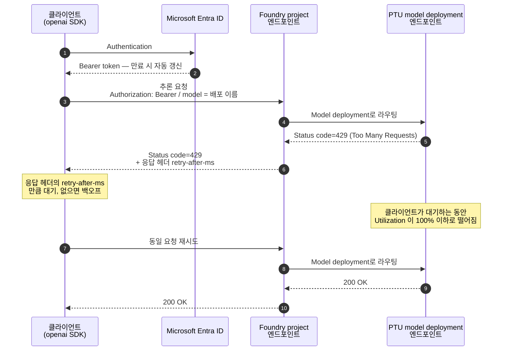

Python 코드의 입력 매개변수에 대한 설명은 아래와 같다.

| Arguments | Required | Default | Description |
|---|---|---|---|
| `--endpoint` | Yes | | 모델 배포 엔드포인트. `/openai/v1/` 까지 포함한 전체 URL |
| `--deployment` | Yes | | PTU 모델 배포 이름 |
| `--api` | | `images.generate` | `images.generate` \| `images.edit` \| `chat.completions` |
| `--auth` | | `entra-id` | `entra-id` \| `entra-id=<스코프>` \| `api-key=<키>` |
| `--prompt` | | | 프롬프트 |
| `--image` | | | 편집할 입력 이미지 경로. `images.edit` 일 때 필수 |
| `--max-tokens` | | `256` | `chat.completions` 전용. PTU 사용률 추정에 직접 반영된다 |
| `--max-attempts` | | `5` | 요청 하나당 최대 시도 횟수 |
| `--burst` | | `1` | 동시 요청 수. 2 이상이면 429 를 실제로 유발할 수 있다 |

```bash
# --burst 로 동시 요청을 걸어 429 를 실제로 유발한다
python foundry-model-ptu-deploy-429-retry.py \
  --endpoint https://<foundry-resource-subdomain>.openai.azure.com/openai/v1/ \
  --deployment gpt-image-2 \
  --burst 20 --max-attempts 6
```

응답 헤더는 [3.1.1](#311-응답-헤더-정보) 표에서 다룬다. `--api chat.completions` 인 경우, `--max-tokens` 로 지정한 값이 PTU [사용률 추정](https://learn.microsoft.com/en-us/azure/ai-foundry/openai/how-to/provisioned-get-started)에 고려된다. 실제 생성량보다 `--max-tokens` 을 크게 잡으면 utilization 이 과도하게 증가하여 동시 처리량이 줄어든다. 단, 이미지 모델(`images.*`)은 이 파라미터를 받지 않는다. `retry-after-ms` 가 있으면 그 값을, 없으면 지수 백오프(1s → 2s → 4s …, 상한 30s)를 쓴다.

#### 3.2.1 openai SDK 의 `max_retries` 고려

openai SDK 는 408/409/429/5xx HTTP status code 와 함께 전달된 `retry-after-ms` 값을 고려하여 총 2회 재시도한다. Python 코드는 응답 헤더를 직접 보여주기 위해 `max_retries=0` 으로 설정하였다. 클라이언트에서 직접 `retry-after-ms` 을 처리하지 않고자 한다면 `max_retries>=1` 으로 설정한다.

```python
OpenAI(...).with_options(max_retries=5).chat.completions.create(...)
```

### 3.3 `foundry-model-ptu-deploy-429-spillover.py`

PTU 모델 배포가 429 HTTP status code 으로 반환할 경우 다른 모델 배포로 spillover 하는 방법들에 대해 다룬다. Python 코드의 입력 매개변수에 대한 설명은 아래와 같다.

| Arguments | Required | Default | Description |
|---|---|---|---|
| `--endpoint` | Yes | | 모델 배포 엔드포인트. `/openai/v1/` 까지 포함한 전체 URL |
| `--deployment` | Yes | | PTU 모델 배포 이름 |
| `--spillover-deployment` | `client` / `header` 시 | | spillover 대상 Standard(PayGo) 배포 이름 |
| `--api` | | `images.generate` | `images.generate` \| `chat.completions` |
| `--auth` | | `entra-id` | `entra-id` \| `entra-id=<스코프>` \| `api-key=<키>` |
| `--prompt` | | | 프롬프트 |
| `--spillover-mode` | |  | 미지정시, [PTU 모델 배포 속성](#331-ptu-모델-배포-속성으로-spillover-처리)에 따라 spillover 처리<br/>`header` 설정시, [Foundry project 서비스](#332-foundry-project-서비스에서-spillover-처리)에서 spillover 처리 <br/>`client` 설정시, [클라이언트](#333-클라이언트에서-spillover-처리)에서 spillover 처리 |

응답 헤더는 [3.1.1](#311-응답-헤더-정보) 표에서 다룬다.

#### 3.3.1. PTU 모델 배포 속성으로 spillover 처리

PTU 모델 배포에 [2.4](#24-상세-설정하여-모델-배포하기) 의 [Traffic spillover] 로 지정된 모델 배포로 spillover 를 수행한다.

```bash
python foundry-model-ptu-deploy-429-spillover.py \
  --endpoint https://<foundry-resource-subdomain>.openai.azure.com/openai/v1/ \
  --deployment gpt-image-2
```

#### 3.3.2. Foundry project 서비스에서 spillover 처리

클라이언트에서 요청 헤더에 spillover 될 모델 배포를 `x-ms-spillover-deployment` 로 지정한다. PTU 가 실패하면 Foundry project 서비스에서 spillover 될 모델 배포로 요청을 전달한다.

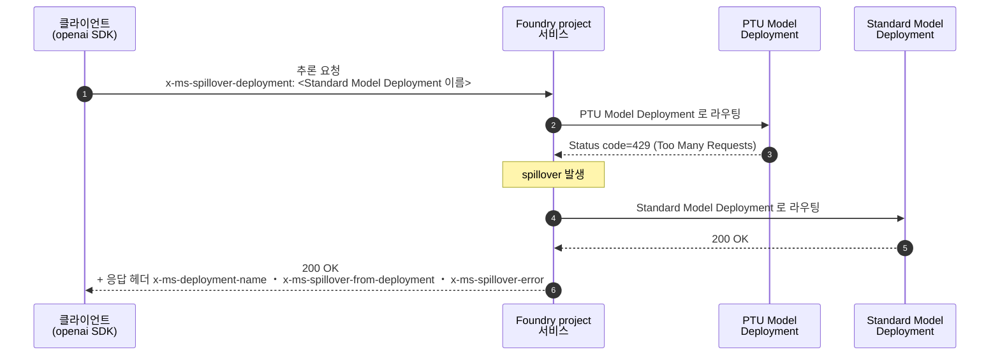

```bash
python foundry-model-ptu-deploy-429-spillover.py \
  --endpoint https://<foundry-resource-subdomain>.openai.azure.com/openai/v1/ \
  --deployment gpt-image-2 \
  --spillover-deployment gpt-image-2-paygo \
  --spillover-mode header
```

본 방법은 클라이언트 - 서비스간 왕복이 1번 발생하여 latency 를 줄인다. 요청 헤더에 `x-ms-spillover-deployment` 을 붙인 요청에만 적용되므로, 워크로드별 최적화가 가능하다. Standard 모델 배포마저 실패하면 Standard 모델 배포의 상태 코드와 본문이 그대로 반환된다. 이때도 `x-ms-spillover-from-deployment` 와 `x-ms-spillover-error` 는 남아 있어 spillover 실패와 Standard 모델 배포 직접 실패를 구분할 수 있다.

> [!NOTE]
> PTU 모델 배포에 배포 속성 `spilloverDeploymentName` 이 이미 설정돼 있으면 **배포 설정이 우선**하고 요청 헤더는 무시된다([3.3.1](#331-ptu-모델-배포-속성으로-spillover-처리) 이 이긴다). 요청 단위로만 제어하려면 PTU 모델 배포의 [Traffic spillover] 를 비워 둔다.

서비스는 overage 요청을 넘기기 전에 PTU 모델 배포로 보내는 것을 우선하므로, spillover 된 요청에는 그만큼의 지연이 더해질 수 있다.

#### 3.3.3. 클라이언트에서 spillover 처리

클라이언트가 PTU 배포의 응답을 보고 직접 전환한다. 200 이 아닌 HTTP status code 이거나 응답 자체가 오지 않으면(연결 실패・타임아웃) standard 배포로 요청을 spillover 한다.

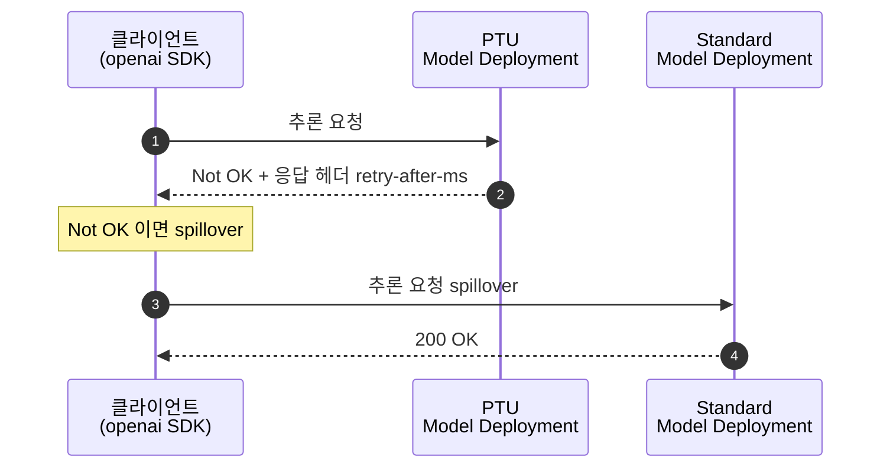

```bash
python foundry-model-ptu-deploy-429-spillover.py \
  --endpoint https://<foundry-resource-subdomain>.openai.azure.com/openai/v1/ \
  --deployment gpt-image-2 \
  --spillover-deployment gpt-image-2-paygo \
  --spillover-mode client
```
본 방법은 Not OK 인 응답 HTTP status code 를 클라이언트의 워크로드 특성에 맞춰 직접 제어한다. Spillover 에 대해 Foundry project 서비스가 관여하지 않으므로 응답 헤더에 `x-ms-spillover-*` 가 붙지 않는다. 어느 배포가 처리했는지는 `x-ms-deployment-name` 으로 확인한다.

## 4. 마무리

PTU 모델 배포는 정해진 처리 용량내에서 추론을 수행하므로, Not OK 되는 응답에 대해서 결정 로직이 필요하다. 문제는 "비용과 지연 중 무엇을 지킬 것인지" 이고, 결정에 따라 사용할 Python 코드는 아래와 같다.

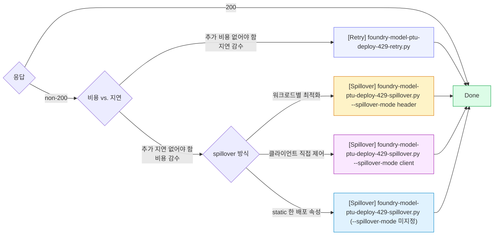