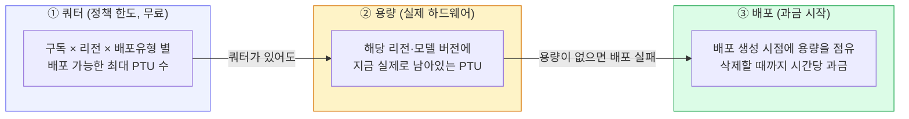
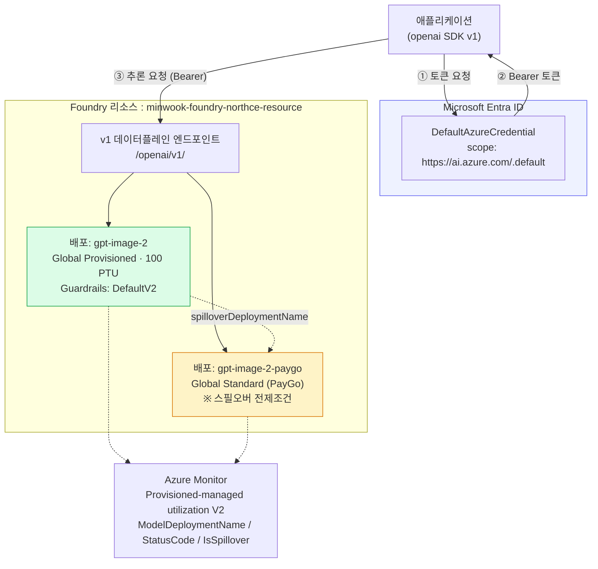
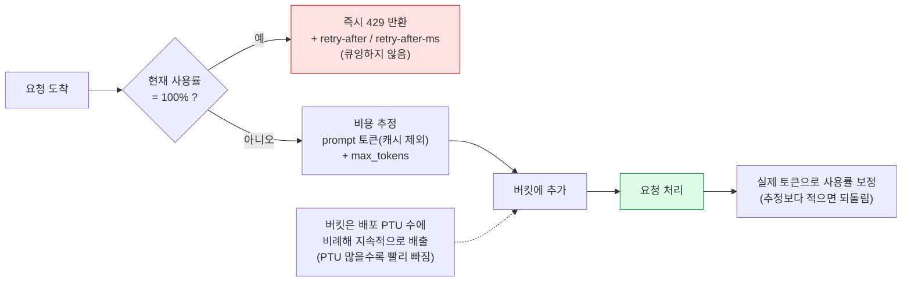
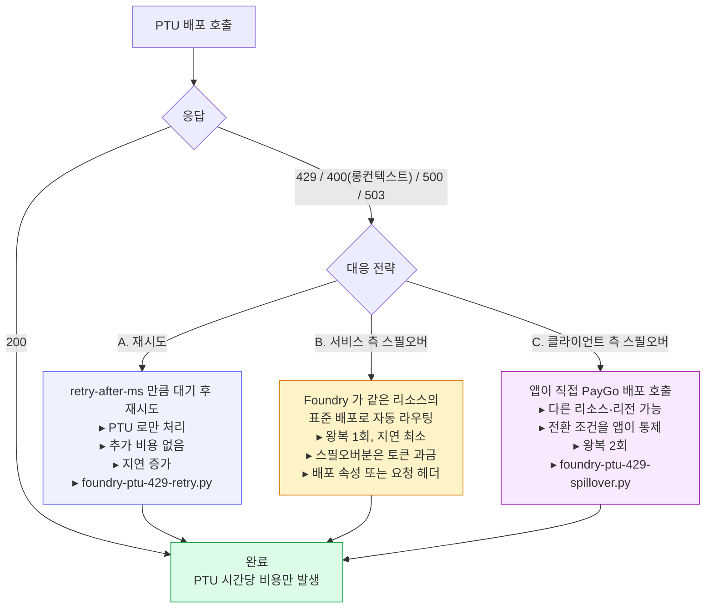
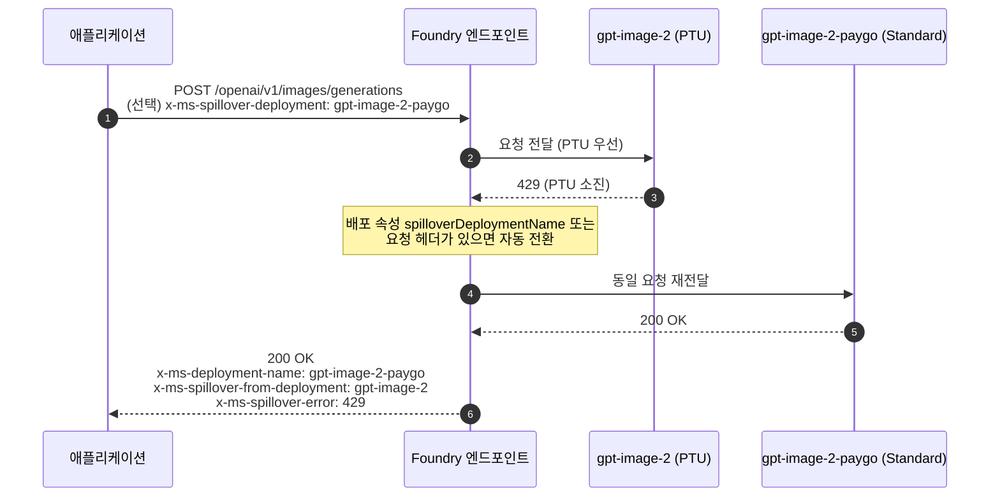
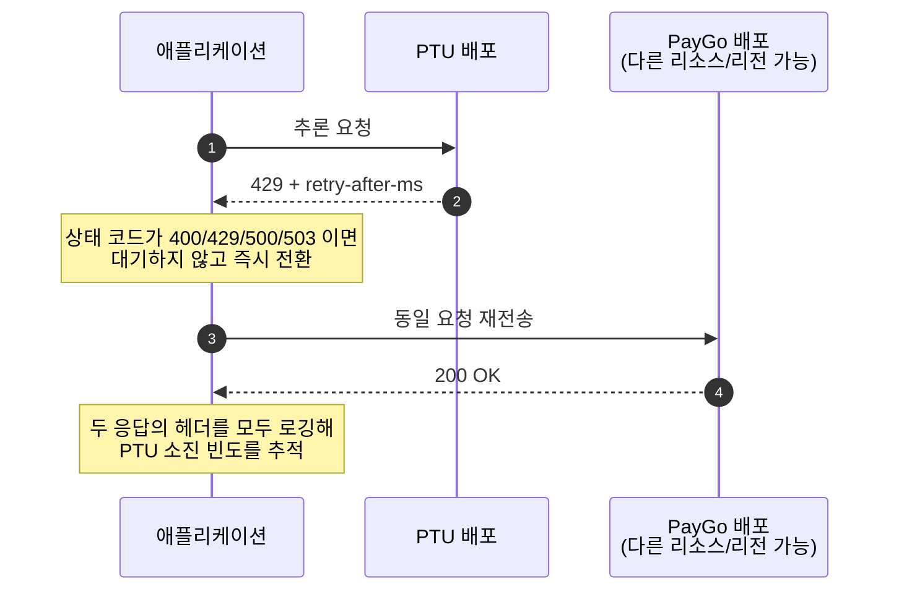
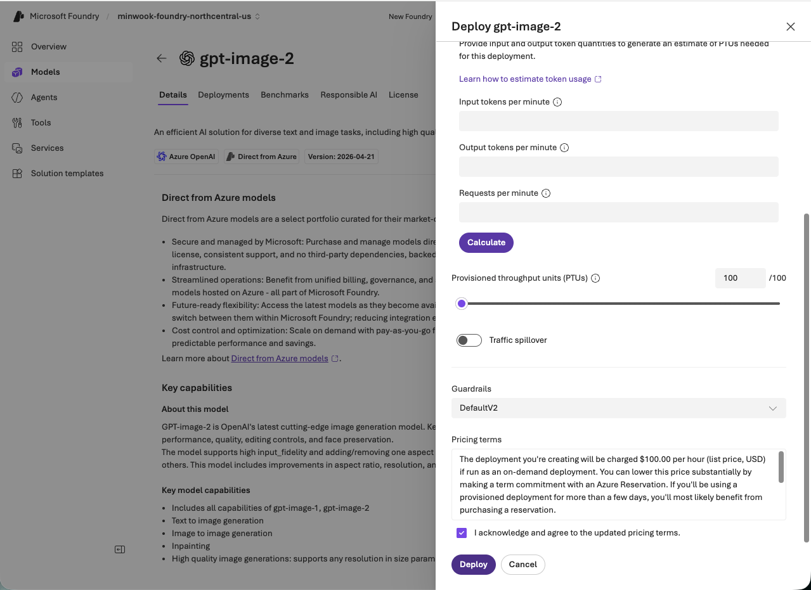

# Microsoft Foundry PTU 배포 가이드

Microsoft Foundry(신규 포털)에서 **PTU(Provisioned Throughput Unit)** 배포를 만들고, 429 를 다루고, 스필오버로 트래픽을 흘려보내는 방법을 다룬다.

포털 화면은 `minwook-foundry-northcentral-us` 프로젝트에서 `gpt-image-2` 모델을 **Global Provisioned Throughput 100 PTU** 로 배포한 실제 캡처를 사용한다. 개념과 코드는 다른 모델(gpt-5.x 계열 등)에도 그대로 적용된다.

---

## 목차

1. [세 줄 요약](#세-줄-요약)
2. [PTU 개념 정리](#1-ptu-개념-정리)
3. [아키텍처 블록 다이어그램](#2-아키텍처-블록-다이어그램)
4. [포털에서 PTU 배포하기](#3-포털에서-ptu-배포하기)
5. [응답 헤더 레퍼런스](#4-응답-헤더-레퍼런스)
6. [샘플 코드 실행](#5-샘플-코드-실행)
7. [429 대응 전략 선택](#6-429-대응-전략-선택)
8. [모니터링](#7-모니터링)
9. [정리 — 과금 중단](#8-정리--과금-중단)
10. [참고 문서](#9-참고-문서)

---

## 세 줄 요약

- **PTU 는 전용 처리 용량을 시간 단위로 사는 것**이다. 토큰당 과금이 아니라 배포가 살아있는 동안 `$/PTU/hr` 로 계속 과금된다. 배포를 지워야 과금이 멈춘다.
- **PTU 배포의 429 는 장애가 아니라 트래픽 관리 신호**다. 사용률이 100% 에 닿으면 큐잉 없이 즉시 429 를 돌려주고, `retry-after-ms` / `retry-after` 헤더로 언제 다시 오면 되는지 알려준다.
- **429 를 흘려보내는 방법은 세 가지**다 — 헤더를 보고 재시도, 서비스가 표준 배포로 넘겨주는 스필오버(`spilloverDeploymentName` 또는 `x-ms-spillover-deployment`), 클라이언트가 직접 PayGo 배포로 전환. 이 리포의 스크립트 3종이 각각을 구현한다.

---

## 1. PTU 개념 정리

### 1.1 배포 유형 비교

| 배포 유형 | 과금 | 지연 SLA | 적합한 워크로드 |
|---|---|---|---|
| **Standard (PayGo)** | 토큰당 | 없음 | 개발·테스트, 변동이 큰 프로덕션 |
| **Priority processing** | 토큰당 (우선 요금) | 모델별 지연 목표 | 장기 약정 없이 일관된 저지연이 필요한 경우 |
| **Provisioned (PTU)** | PTU 시간당 또는 Azure 예약 | 모델별 지연 목표 | 대규모·미션크리티컬, 처리량 보장 필요 |
| **Batch** | 토큰당 (할인 요금) | 없음 | 지연 요구 없는 대량 비동기 처리 |

### 1.2 PTU 배포의 세 가지 라우팅 유형

| 유형 | CLI `sku-name` | 데이터 라우팅 |
|---|---|---|
| **Global Provisioned** | `GlobalProvisionedManaged` | 전 세계 Azure 리전으로 라우팅. 가용성 최고 |
| **Data Zone Provisioned** | `DataZoneProvisionedManaged` | 지리적 존(US 또는 EU) 내부 |
| **Regional Provisioned** | `ProvisionedManaged` | 배포된 단일 리전 내부. 엄격한 데이터 레지던시용 |

> 캡처된 배포는 **Global Provisioned Throughput** 이다. 저장 데이터는 리소스의 Azure 지리 내에 남지만, 처리는 리소스 리전 밖에서 일어날 수 있다.

### 1.3 PTU / 쿼터 / 용량 — 셋은 다르다



핵심 함정:

- **쿼터가 있다고 용량이 보장되지 않는다.** 용량은 하루 중에도 계속 변한다.
- **배포를 줄이거나 지우면 용량이 리전 풀로 반환**되고, 다시 올릴 때 같은 용량이 있다는 보장이 없다.
- **예약(Reservation)도 용량을 보장하지 않는다.** 반드시 **배포를 먼저 만들어 용량을 확인한 뒤** 예약을 산다.

### 1.4 PTU 사이징

세 가지 입력으로 정해진다.

| 입력 | 설명 |
|---|---|
| **요청 형태** | RPM, 평균 입력 토큰, 평균 출력 토큰 |
| **출력/입력 비율** | 출력 토큰이 입력보다 용량을 더 먹는다. GPT-4.1 이후 Azure OpenAI 모델은 global standard 가격의 출력/입력 비율과 같다 |
| **캐시율** | 프롬프트 캐시로 처리된 입력 토큰은 **용량을 소비하지 않는다**(100% 할인) |

이를 **정규화 TPM** 하나로 합친 뒤, 모델별 **Input TPM per PTU** 로 나누면 필요한 PTU 수가 나온다. 포털의 **PTU Calculator** 가 이 계산을 대신해 준다.

### 1.5 과금

- **시간당 과금**: 배포를 만든 순간 미터가 켜지고, 삭제해야 꺼진다. 토큰을 한 개도 안 써도 과금된다.
- **Azure 예약**: 1개월 / 1년 약정으로 `$/PTU/hr` 를 크게 할인. 배포가 아니라 **PTU 미터에 적용되는 재무 할인**이라 배포와 느슨하게 결합돼 있다.
- 캡처 시점 기준 `gpt-image-2` Global Provisioned 100 PTU 의 온디맨드 정가는 **시간당 $100.00 (USD)** 이었다. 즉 **$1.00 / PTU / hr**. 실제 요금은 모델·리전·시점에 따라 다르므로 배포 화면의 Pricing terms 를 반드시 확인한다.

> 트래픽에 맞춰 PTU 를 올렸다 내렸다 하며 시간당 과금으로 버티는 전략은 권장되지 않는다. 다시 올릴 때 용량이 없을 수 있고, 고사용률 상태의 연속 시간당 과금은 보통 예약 가격을 넘어선다.

---

## 2. 아키텍처 블록 다이어그램

### 2.1 전체 구성



### 2.2 PTU 사용률과 429 — leaky bucket



> `max_tokens` 를 실제 생성량보다 크게 잡으면 버킷을 과하게 채워 **동시 처리량이 줄어든다.** 가능한 한 실제 값에 가깝게 지정할 것.

### 2.3 429 대응 3가지 경로



### 2.4 서비스 측 스필오버 시퀀스



> 표준 배포마저 실패하면 표준 배포의 상태 코드와 본문이 그대로 반환된다. 이때도 `x-ms-spillover-from-deployment` 와 `x-ms-spillover-error` 는 남아 있어, "스필오버 실패"와 "표준 배포 직접 실패"를 구분할 수 있다.

### 2.5 클라이언트 측 스필오버 시퀀스



---

## 3. 포털에서 PTU 배포하기

### 3.1 프로젝트 홈에서 엔드포인트 확인


**New Foundry** 토글이 켜져 있어야 한다. 홈 화면에서 두 종류의 엔드포인트를 확인할 수 있다.

| 항목 | 값 |
|---|---|
| Project endpoint | `https://minwook-foundry-northce-resource.services.ai.azure.com/...` |
| Azure OpenAI endpoint | `https://minwook-foundry-northce-resource.openai.azure.com/...` |
| API key | **비활성화됨** → Entra ID 인증만 사용 |

> 추론에는 두 호스트 중 어느 쪽을 써도 된다. 다만 **경로가 반드시 `/openai/v1/` 로 끝나야** 하며, 아니면 404 가 난다. 스크립트는 `FOUNDRY_ENDPOINT` 에 호스트만 넣어도 이 경로를 자동으로 붙인다.

### 3.2 모델 검색


**Discover → Models** 에서 모델을 찾는다. 좌측 필터의 **Deployment SKU** / **Collections(Direct from Azure)** 로 PTU 지원 모델만 좁힐 수 있다.

### 3.3 Deploy → Custom settings


**Deploy** 버튼의 두 갈래 중 반드시 **Custom settings** 를 고른다.

- *Default settings*: global standard + 기본 쿼터 → **PTU 배포가 아니다**
- *Custom settings*: SKU, 쿼터, PTU, 스필오버, 가드레일 직접 지정

### 3.4 배포 유형과 PTU 계산기


| 항목 | 캡처 값 |
|---|---|
| Deployment name | `gpt-image-2` |
| Deployment type | **Global Provisioned Throughput** |
| Model version | `2026-04-21-private` |

**Calculate provisioned throughput unit (PTU) capacity** 에 다음 세 값을 넣고 **Calculate** 를 누르면 필요한 PTU 추정치가 나온다.

- Input tokens per minute
- Output tokens per minute
- Requests per minute

### 3.5 PTU 수량과 요금 확인



- **Provisioned throughput units (PTUs)**: `100 / 100` — 슬라이더 오른쪽 값이 이 구독·리전·배포유형의 남은 쿼터다.
- **Guardrails**: `DefaultV2`
- **Pricing terms**: *"charged $100.00 per hour (list price, USD) if run as an on-demand deployment"* — Azure Reservation 으로 크게 낮출 수 있다는 안내가 함께 나온다.
- 체크박스에 동의해야 **Deploy** 가 활성화된다.

### 3.6 Traffic spillover 켜기


**Traffic spillover** 토글을 켜면 **Spillover deployment** 를 골라야 한다. 이것이 배포 속성 `spilloverDeploymentName` 에 해당한다.

> ⚠️ 캡처의 경고 그대로: **동일 모델·동일 버전의 활성 표준(PayGo) 배포가 같은 리소스 안에 최소 하나 있어야** 스필오버를 켤 수 있다. 없으면 드롭다운이 비어 Deploy 가 막힌다.
>
> → **표준 배포를 먼저 만들고, 그다음 PTU 배포를 만들면서 스필오버를 지정**하는 순서가 편하다. 이미 만든 PTU 배포에 나중에 추가해도 된다.

REST 로 설정할 경우:

```bash
curl -X PUT "https://management.azure.com/subscriptions/<SUB_ID>/resourceGroups/<RG>/providers/Microsoft.CognitiveServices/accounts/<ACCOUNT>/deployments/gpt-image-2?api-version=2024-10-01" \
  -H "Content-Type: application/json" \
  -H "Authorization: Bearer $(az account get-access-token --resource https://management.azure.com --query accessToken -o tsv)" \
  -d '{
        "sku": { "name": "GlobalProvisionedManaged", "capacity": 100 },
        "properties": {
          "spilloverDeploymentName": "gpt-image-2-paygo",
          "model": { "format": "OpenAI", "name": "gpt-image-2", "version": "2026-04-21" }
        }
      }'
```

### 3.7 배포 확인


**Build → Models → Deployments → Serverless deployments** 에서 상태를 확인한다. `Deployment type` 이 `Global Provi...`, `Deployment status` 가 `Succeeded` 면 완료다. 이 화면 상단의 **PTU Calculator** 버튼으로 사이징을 다시 계산할 수도 있다.

### 3.8 샘플 코드 확인


Playground 의 **View code** 를 누르면,


Language / Authentication method 를 고른 샘플이 나온다. **Entra ID authentication** 기준 Python 코드가 이 리포 스크립트의 출발점이다.

```python
from openai import OpenAI
from azure.identity import DefaultAzureCredential, get_bearer_token_provider

endpoint = "https://minwook-foundry-northce-resource.services.ai.azure.com/openai/v1"
deployment_name = "gpt-image-2"
token_provider = get_bearer_token_provider(
    DefaultAzureCredential(), "https://ai.azure.com/.default"
)

client = OpenAI(base_url=endpoint, api_key=token_provider)
```

포인트 세 가지:

1. `AzureOpenAI` 가 아니라 **`OpenAI`** 클라이언트를 쓴다 (v1 데이터플레인).
2. `api_key` 에 **토큰 프로바이더 함수를 그대로 넘긴다** — 만료 시 자동 갱신된다. `openai>=1.106.0` 필요.
3. `model` 파라미터에는 모델 이름이 아니라 **배포 이름**을 넣는다.

### 3.9 배포 삭제 = 과금 중단


시간당 과금은 배포를 지워야 멈춘다. 자세한 정리 절차는 [8절](#8-정리--과금-중단) 참고.

---

## 4. 응답 헤더 레퍼런스

세 스크립트 모두 **모든 응답 헤더를 그룹으로 나눠 출력**한다. 분류에 없는 헤더도 `[기타]` 로 전부 찍히므로, 서비스가 새 헤더를 추가해도 놓치지 않는다.

### 4.1 스로틀링 / 재시도

| 헤더 | 의미 |
|---|---|
| `retry-after-ms` | **밀리초 단위 대기 시간.** 더 정밀하므로 우선 사용 |
| `retry-after` | 초 단위 대기 시간 |
| `x-ratelimit-remaining-requests` | 남은 요청 수 |
| `x-ratelimit-remaining-tokens` | 남은 토큰 수 |
| `x-ratelimit-limit-requests` / `-tokens` | 한도 |
| `x-ratelimit-reset-requests` / `-tokens` | 한도 리셋까지 남은 시간 |

> PTU 배포는 429 와 함께 `retry-after` **와** `retry-after-ms` 를 모두 돌려준다. 임의의 지수 백오프보다 이 값을 쓰는 편이 정확하다 — 버킷이 언제 비는지는 서비스만 알기 때문이다.

### 4.2 스필오버

| 헤더 | 의미 |
|---|---|
| `x-ms-deployment-name` | **실제로 요청을 처리한 배포 이름.** 스필오버됐다면 표준 배포 이름이 들어온다 |
| `x-ms-spillover-from-deployment` | **존재 자체가 스필오버됐다는 뜻.** 값은 원래의 PTU 배포 이름 |
| `x-ms-spillover-error` | 스필오버를 유발한 PTU 쪽 원본 상태 코드 (429 / 500 / 503 등). 스필오버 성공 여부와 무관하게 항상 붙는다 |

`foundry-ptu-basic.py` 는 이 세 헤더만 보고 **서비스 측 스필오버가 실제로 일어났는지** 판정한다.

### 4.3 추적 / 진단

`apim-request-id`, `x-request-id`, `x-ms-request-id`, `x-ms-client-request-id`, `x-ms-region`, `azureml-model-session`, `openai-processing-ms`, `openai-model`, `x-envoy-upstream-service-time`

지원 티켓을 열 때는 `apim-request-id` 또는 `x-request-id` 를 함께 제출한다.

---

## 5. 샘플 코드 실행

### 5.1 파일 구성

| 파일 | 역할 |
|---|---|
| `foundry_ptu_common.py` | 설정 로딩 · 클라이언트 생성 · 호출 · **헤더 덤프** 공용 모듈 (세 스크립트가 공유) |
| `foundry-ptu-basic.py` | 기본 호출 1회. 헤더 전체 출력 + **서비스 측 스필오버 발생 여부 판정** |
| `foundry-ptu-429-retry.py` | 429 를 `retry-after-ms` 기준으로 재시도. 백오프 폴백 + 부하 생성 |
| `foundry-ptu-429-spillover.py` | **클라이언트 측 스필오버**(PTU → PayGo) 및 요청 헤더 방식 비교 |

세 스크립트가 동일한 헤더 덤프 로직을 쓰므로 공용 모듈로 분리했다. 스크립트만 단독으로 복사해 가면 동작하지 않으니 `foundry_ptu_common.py` 를 함께 둔다.

### 5.2 설치

```bash
python3 -m venv .venv && source .venv/bin/activate
pip install "openai>=1.106.0" azure-identity
az login   # DefaultAzureCredential 이 사용할 자격 증명
```

Entra ID 인증에는 Foundry 리소스에 대한 **Cognitive Services OpenAI User** 이상의 역할이 필요하다.

### 5.3 환경 변수

| 변수 | 필수 | 기본값 | 설명 |
|---|---|---|---|
| `FOUNDRY_ENDPOINT` | ✅ | — | 리소스 엔드포인트. `/openai/v1/` 는 자동으로 붙여준다 |
| `FOUNDRY_PTU_DEPLOYMENT` | ✅ | — | PTU 배포 이름 |
| `FOUNDRY_STANDARD_DEPLOYMENT` | 스필오버 시 ✅ | — | 표준(PayGo) 배포 이름 |
| `FOUNDRY_STANDARD_ENDPOINT` | | PTU 와 동일 | 표준 배포가 **다른 리소스**에 있을 때만 지정 |
| `FOUNDRY_API_KEY` | | (없음) | 지정하면 키 인증, 없으면 Entra ID |
| `FOUNDRY_TOKEN_SCOPE` | | `https://ai.azure.com/.default` | classic 데이터플레인은 `https://cognitiveservices.azure.com/.default` |
| `FOUNDRY_MODE` | | `image` | `image` \| `chat` |
| `FOUNDRY_PROMPT` | | 모드별 기본값 | 프롬프트 |
| `FOUNDRY_IMAGE_SIZE` | | `1024x1024` | image 모드 전용 |
| `FOUNDRY_MAX_TOKENS` | | `256` | chat 모드 전용. **PTU 사용률 추정에 직접 반영**되므로 실제 생성량에 맞춘다 |
| `FOUNDRY_MAX_ATTEMPTS` | | `5` | retry 스크립트 최대 시도 횟수 |
| `FOUNDRY_BURST` | | `1` | 동시 요청 수. 2 이상이면 429 를 실제로 유발할 수 있다 |
| `FOUNDRY_SPILLOVER_MODE` | | `client` | `client` \| `header` \| `both` |

```bash
export FOUNDRY_ENDPOINT="https://minwook-foundry-northce-resource.openai.azure.com"
export FOUNDRY_PTU_DEPLOYMENT="gpt-image-2"
export FOUNDRY_STANDARD_DEPLOYMENT="gpt-image-2-paygo"
export FOUNDRY_MODE="image"
```

### 5.4 실행

**① 기본 호출 — 헤더로 현재 상태 파악**

```bash
python foundry-ptu-basic.py
```

출력에서 확인할 것:

- `x-ms-deployment-name` 이 PTU 배포 이름인가 → 스필오버 없이 PTU 가 직접 처리
- `x-ms-spillover-from-deployment` 가 있는가 → **배포 속성 스필오버가 동작 중**
- `[스필오버 판정]` 섹션이 위 두 헤더를 사람이 읽을 문장으로 정리해 준다

**② 429 재시도 — 부하를 걸어 실제로 유발**

```bash
FOUNDRY_BURST=20 FOUNDRY_MAX_ATTEMPTS=6 python foundry-ptu-429-retry.py
```

`retry-after-ms` 가 있으면 그 값을, 없으면 지수 백오프(1s → 2s → 4s …, 상한 30s)를 쓴다. 동시 요청이 같은 시각에 재차 몰리지 않도록 25% 지터를 더한다. 워커별 시도 횟수와 총 대기 시간이 요약으로 나온다.

**③ 클라이언트 측 스필오버**

```bash
# PTU 실패 시 앱이 직접 PayGo 배포로 전환
python foundry-ptu-429-spillover.py

# 서비스에 per-request 스필오버를 요청 (x-ms-spillover-deployment 헤더)
FOUNDRY_SPILLOVER_MODE=header python foundry-ptu-429-spillover.py

# 두 방식을 나란히 비교
FOUNDRY_SPILLOVER_MODE=both FOUNDRY_BURST=20 python foundry-ptu-429-spillover.py
```

> ⚠️ 배포 속성 `spilloverDeploymentName` 이 이미 설정돼 있으면 **배포 설정이 우선**하고 `x-ms-spillover-deployment` 헤더는 무시된다. 요청 단위로만 제어하려면 배포 속성을 비워 둔다.

### 5.5 SDK 자동 재시도와의 관계

openai SDK 는 기본적으로 408/409/429/5xx 를 `retry-after` 를 존중하며 2회 재시도한다. 이 샘플들은 **매 시도의 헤더를 직접 보여주기 위해 `max_retries=0` 으로 꺼두었다.**

프로덕션에서 굳이 직접 구현할 필요는 없다. SDK 에 맡기려면:

```python
client = OpenAI(base_url=endpoint, api_key=token_provider, max_retries=5)

# 또는 요청 단위로
client.with_options(max_retries=5).chat.completions.create(...)
```

---

## 6. 429 대응 전략 선택

| 상황 | 권장 전략 |
|---|---|
| 지연에 민감하고 비용 초과를 감수할 수 있다 | **서비스 측 스필오버** — 왕복 1회로 가장 빠르다. Global / Data Zone Provisioned 배포에는 기본으로 켜두길 권장 |
| PTU 비용 안에서만 처리해야 한다 (배치성, 비대화형) | **재시도** — `retry-after-ms` 만큼 대기. 추가 토큰 비용 없음 |
| PayGo 백업이 다른 리소스·리전에 있거나, 전환 조건을 세밀하게 통제해야 한다 | **클라이언트 측 스필오버** |
| 롱컨텍스트 요청이 400 으로 떨어진다 (예: gpt-4.1 계열 PTU 는 128K 미만만 지원) | **스필오버** — 재시도해도 계속 400 이다 |

비용 관점:

- PTU 가 처리한 요청 → **시간당 PTU 비용만.** 추가 과금 없음
- 스필오버되어 표준 배포가 처리한 요청 → 해당 모델·배포유형의 **입력 / 캐시 / 출력 토큰 요금**이 별도 발생

---

## 7. 모니터링

### 7.1 PTU 사용률

Azure Portal → 리소스 → **Metrics** → **Provisioned-managed utilization V2**

```
PTU 사용률 = 기간 내 소비 PTU / 기간 내 배포 PTU
```

배포가 여러 개면 **Apply splitting** 으로 배포별로 나눠 본다. 지속적으로 100% 에 붙어 있으면 PTU 를 늘리거나 스필오버를 켜야 한다는 신호다.

### 7.2 스필오버 트래픽 분리

`Azure OpenAI Requests` 메트릭에 다음 분할을 적용한다.

| 분할 | 용도 |
|---|---|
| `ModelDeploymentName` | PTU 배포 vs 표준 배포 처리량 비교 |
| `StatusCode` | 200 / 429 분포 |
| `IsSpillover` | **표준 배포로 들어온 트래픽 중 스필오버분만 분리** |

> 중요: 스필오버된 요청은 PTU 배포 쪽에 429 로 **집계되지 않는다.** 표준 배포에 `IsSpillover = True` + 최종 상태 코드(보통 200)로 기록된다. PTU 배포의 429 카운트만 보고 "스필오버가 없다"고 판단하면 안 된다.

---

## 8. 정리 — 과금 중단

시간당 과금은 배포 생성 시점에 시작해 삭제 시점에 멈춘다. 리소스만 지우고 배포를 남기면 **리소스를 purge 할 때까지 과금이 계속된다.**

1. 포털에서 **배포를 먼저 삭제**한다 (3.9 캡처).
2. 리소스도 지운다면 **모든 배포를 지운 뒤** 리소스를 삭제한다.
3. 삭제한 리소스를 **purge** 해 과금을 확실히 끊는다.
4. **예약은 배포 삭제로 취소되지 않는다.** Azure Portal → Reservations 에서 별도로 취소/교환한다 (수수료 발생 가능).

---

## 9. 참고 문서

- [Provisioned throughput for Foundry Models](https://learn.microsoft.com/en-us/azure/ai-foundry/openai/concepts/provisioned-throughput)
- [Operate provisioned throughput deployments in production](https://learn.microsoft.com/en-us/azure/ai-foundry/openai/how-to/provisioned-get-started)
- [Manage traffic with spillover for provisioned deployments](https://learn.microsoft.com/en-us/azure/ai-foundry/openai/how-to/spillover-traffic-management)
- [Azure OpenAI SDK language support](https://learn.microsoft.com/en-us/azure/foundry/openai/supported-languages)
- [Deployments - Create Or Update (REST)](https://learn.microsoft.com/en-us/rest/api/aiservices/accountmanagement/deployments/create-or-update)
- [azure-openai-benchmark (부하 테스트 도구)](https://github.com/Azure/azure-openai-benchmark)
- [PTU 쿼터 요청 폼](https://aka.ms/oai/stuquotarequest)
